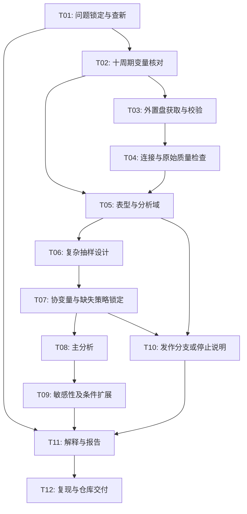

# NHANES 1999–2018 哮喘与类风湿关节炎研究计划

版本：0.2，2026-09-23。状态：**研究问题已由用户确认；研究计划待整体确认；未执行分析**。

## 阶段、输入、输出与验证标准

- 当前阶段：阶段二，观察性研究/分析方案编写。不是干预实验。
- 正式背景输入：[已由用户确认研究问题的 idea 文档](../research_ideas/2026-09-23-nhanes-asthma-ra-idea.md)。不伪记为老师已确认，也不将研究问题确认扩大为实施授权。
- 方法依据：[来源登记](../evidence/2026-09-23-source-register.md)所列官方资料。方法文献可以支持细化，不能暗中改变正式 idea 的问题范围。
- 输出：本计划、任务依赖图、验收标准、数据与结果交付约定。
- 文档验收：C1–C5 均有任务、对照/反证检查和失败解释；权重、病例定义、缺失、人群、效应解释可追溯。
- 实施入口：用户确认本计划，完成数据路径核实后才实现代码并读取研究数据。出现核心问题改变须先修订 idea 和计划。

## 1. 科研问题与从 idea 提取的 claims

### 1.1 主问题：两病共存

**在 NHANES 1999–2018 的 20 岁及以上美国非机构化平民成人中，自报医生诊断的 RA 者是否更常报告当前哮喘？考虑年龄、性别、吸烟及社会经济差异后，这一患病关联的大小和不确定性如何？**

RA 是 rheumatoid arthritis（类风湿关节炎）。本研究的 RA 实际指“自报曾被医生告知有关节炎，且报告类型为 RA”。当前哮喘指“曾被医生告知患哮喘，且目前仍有哮喘”。二者诊断标准和测量时间不完全对称，须如实命名。

设计为十个两年周期合并的横断面研究，不把不同受访者当成随访同一队列。主分析将 RA 作为分组因素、当前哮喘作为结局，目的为清楚表达关联，不主张 RA 先发生或导致哮喘。

### 1.2 次要问题：已患哮喘者的急性负担

仅在数据和事件数合格时，比较当前哮喘成人中有/无自报 RA 者过去一年发作和因哮喘急诊就诊的情况。已存在直接相近研究，此分支定位为复现/稳健性扩展，不能自动作为原创主发现。它不替代主问题，停做此分支不构成主研究失败。

### 1.3 Claims

| 编号 | 待验证内容 | 不允许的替代说法 |
|---|---|---|
| C1 | 各纳入周期可构建可比较表型 | 有同名字段就可直接合并 |
| C2 | 自报 RA 与当前哮喘存在患病关联 | RA 导致哮喘或增加新发风险 |
| C3 | 当前哮喘者中 RA 与急性负担有关 | RA 导致临床重度哮喘 |
| C4 | 结果在合理定义和偏倚检查下稳定 | 已排除全部混杂或证明因果 |
| C5 | 本研究相对已有文献有明确新增信息 | 年份更多即创新、显著即可发表 |

## 2. Claim-to-evidence 验证矩阵

| Claim | 任务 | 证据/输出 | 对照或反证检查 | 失败时的解释 |
|---|---|---|---|---|
| C1 | T02–T05 | 逐周期变量表、表型转换规则、缺失原因、纳入流程 | 对照官方边际频数；跨周期同义核对；合成记录边界测试 | 无法协调时缩小周期或修订问题，不强合并 |
| C2 | T06–T08 | 复杂抽样加权患病比例、调整后关联及区间 | 未调整与预设调整；无关节炎对照；共同样本重算 | 无差异/反向可能削弱假设；宽区间表示不精确 |
| C3 | T05、T06、T10 | 发作及急诊的二分类关联 | 明确非 RA 哮喘者对照；更改冲突记录处理；与原文可比范围比较 | 稀疏或题目不一致则不做；差异可能来自定义、人群或混杂 |
| C4 | T07–T09 | 同样本模型、定义/缺失/周期敏感性 | 关节炎类型不明、曾患/当前哮喘、周期影响、体检扩展 | 不稳定则限制或撤回总体结论，报告最可能驱动因素 |
| C5 | T01 | 同题文献矩阵、明确新增信息 | 同数据库同人群同结局比对；查找阴性及冲突研究 | 重复则定位为复现或修订 idea，不包装为首创 |

验证任务不保证 claim 成立；交付负面或不确定结果同样可以通过方法验收。

## 3. 人群、数据范围与表型任务

### 3.1 周期与纳入

拟纳入 1999–2000、2001–2002、2003–2004、2005–2006、2007–2008、2009–2010、2011–2012、2013–2014、2015–2016、2017–2018。全部周期可用性尚未核实。

在具备有效设计信息和相应权重的完整源样本上建立调查设计，再采用子总体分析指定年龄≥20 岁及各分析资格。不要先仅保留病例/成人而丢掉估计方差所需的设计结构。主分析的病例状态需可判定；分步报告排除及重叠缺失，保证人数守恒。

不默认排除怀孕、癌症、所有其他慢病；各排除必须与研究问题相关且写明理由。老年年龄顶端编码按周期协调到共同顶端（例如 80+），不将旧周期 85+ 和新周期 80+ 当成精确年龄直接比较；保留原年龄和协调标识。

### 3.2 RA 状态判定

| 原始回答 | 研究状态 |
|---|---|
| 明确有关节炎且类型明确为 RA | RA 阳性 |
| 明确没有关节炎；类型按问卷跳过 | 明确非 RA；类型空白为结构性空白 |
| 明确有关节炎且类型明确为骨关节炎、银屑病关节炎或明确其他类型 | 明确非 RA，同时保留具体类型 |
| 有关节炎但类型不知道、拒答、缺失 | RA 状态不明，不能归为阴性 |
| 关节炎总题拒答、不知道或缺失 | 状态不明 |
| 总题与类型矛盾，或周期允许多类型 | 记录冲突；按原问卷核查；不能静默覆盖 |

主对照为所有明确非 RA 成人；敏感性对照为明确无关节炎者，另可描述骨关节炎作为疾病比较组。其他关节炎并非健康人，也不是严格阴性机制对照。

首尾周期已核实：1999–2000 的 MCQ190 中 1 代表 RA；2017–2018 的 MCQ195 中 2 代表 RA。不能把这两个规则推广到中间周期，必须逐项建表。

### 3.3 哮喘状态判定

- 曾患哮喘：曾被医生告知哮喘题回答“是”。
- 当前哮喘：曾患哮喘为“是”，当前仍有哮喘为“是”。
- 非当前哮喘：曾患题明确“否”（后续合理跳题），或曾患“是”且当前明确“否”。
- 曾患或当前必需回答不明确时标记未知；当前阳性但曾患阴性等冲突需核查，不擅自修复。
- 另保留从未哮喘、既往但非当前、当前、未知四类，敏感性比较当前与从未哮喘，避免既往患者处理不透明。

### 3.4 次要结局

仅在当前哮喘子总体中定义过去一年发作（MCQ040 候选）及哮喘急诊就诊（MCQ050 候选），分别为“是/否/未知”。各周期仍需核实题目和资格。

优先分别报告两项二分类结果。三分类“无发作且无急诊／发作但无急诊／曾急诊”仅为可选复现；急诊是医疗使用指标，不自动等同于临床重度加重。急诊“是”而发作“否”的记录保留并单独统计，分别保留/排除此冲突作敏感性，不改写原回答。缺一项时不得默认归入最低类别。

Gate：T02–T05 verdict 初始为 needs evidence；checked=端点定义；weak point=中间周期与个体冲突；next move=正式协调表及人数审计。

## 4. 每项任务的输入数据

| 模块 | 用途 | 候选字段或内容 | 优先级 |
|---|---|---|---|
| DEMO | 编号、年龄、性别、社会经济、设计 | SEQN、RIDAGEYR、RIAGENDR、RIDRETH1、DMDEDUC2、INDFMPIR、SDDSRVYR、SDMVSTRA、SDMVPSU、访谈及体检权重 | 必需 |
| MCQ | 两病及急性负担 | MCQ010、MCQ035、MCQ160A/a、逐周期关节炎类型；MCQ040/050 | 主问题必需；发作分支条件必需 |
| SMQ | 吸烟 | SMQ020、SMQ040 等候选字段；从未/既往/当前吸烟 | 主调整模型必需，核对访谈资格 |
| BMX | 实测体重相关特征 | BMXBMI 候选，体重指数 | 完整版本扩展，需体检权重 |
| HIQ、HUQ | 医保和就医机会 | 对应周期可比题目，尚未固定字段 | 条件扩展，不假定完整覆盖 |
| RXQ_RX | 用药 | 糖皮质激素等候选药物记录 | 非必需，仅有明确目的时增加 |

本轮不下载实验室、膳食、环境暴露全套数据；这些不是主问题的必要输入。处方药若启用，先聚合为个人层面，防止一人多药造成连接重复。

全周期变量表每行必须记录：周期、模块、字段、题目原文、单位、适用年龄、跳题、阳性/阴性/特殊编码、有效人数、权重类型、来源链接、核对状态及备注。以上候选名不等于已完成逐周期认证。

## 5. 输出结果与仓库结构

确认实施后拟生成下列产物；当前均为计划，不能把未生成文件描述成结果。

| 输出 | 内容 |
|---|---|
| docs/data/variable_dictionary.csv | 经核对的周期变量映射 |
| manifests/downloads.csv | 官方 URL、周期、模块、字节数、下载时间、SHA256、相对原始路径 |
| results/qc/ | 每步人数、重复/冲突/缺失、权重与设计审计、模型诊断 |
| results/tables/ | 样本特征、四格共存表、主关联、敏感性、合格次要分析 |
| results/figures/ | 纳入流程、关联区间图、必要的周期/敏感性图；PDF/SVG 加 PNG |
| reports/ | 中文研究报告、结果解释、限制、机器可读运行状态 |
| scripts/、R/、config/、tests/ | 入口、函数、非本机专属配置、必要测试 |
| renv.lock、session_info.txt | 环境版本和可复现记录 |

汇总表同时给出未加权人数、加权比例/估计及不确定性，二者不能混称。GitHub 只提交代码、公共元数据和汇总结果；个体表、下载原件和个人路径配置不提交。

## 6. 对照与技术验证

- 临床比较：RA vs 明确非 RA；敏感性 RA vs 无关节炎；必要时单独显示骨关节炎组。
- 不存在现成的生物学阳性/阴性对照，不能虚构。技术阳性控制是能正确识别已知规则的合成记录，不是支持假设的患者数据。
- 技术负面测试：RA 编码调换、未知误归阴性、重复连接、无效权重必须触发失败；年龄不符合或未询问须正确归类。
- 频数对照：在未筛选的相同模块/周期复现官方 codebook 边际人数；允许不同最新版本时需查清变更，不静默忽略。
- 独立校验：加权患病比例与直接按同一权重求和的计算核对；标准误仍由复杂抽样方法计算。
- 随机/模拟控制：固定种子的合成数据测试零关联与已设定方向，仅证明实现符合预期；真实数据不做破坏抽样结构的全局标签打乱。不将合成结果写成生物学验证。

## 7. 混杂因素和排除方法

主模型预设调整年龄、性别、可比种族/族裔、调查周期、教育、收入贫困比和吸烟。原因是这些特征可能影响疾病或被诊断机会；当前测量不一定早于患病，故仍不是充分因果调整集。不同周期种族分类优先用可比的 RIDRETH1 口径，并说明精细信息损失。

- 年龄：主模型拟采用连续年龄的三自由度自然样条，内部结点依据分析域加权年龄分布的三分位点，边界为协调年龄范围；结点在模型拟合前记录。顶端编码单列标识作敏感性；线性年龄作简化敏感性，不用结果显著性选择形式。
- 性别、族裔、教育、吸烟及周期按预设类别；收入比主模型连续，另用预设类别检验函数形式，勿将特殊编码当数值。
- 体重指数（BMI，即体重千克数除以身高米数的平方）在体检扩展中加入；它也可能受病后行为/药物影响，仅作条件关联解释。
- 医保/医疗使用可能影响诊断机会，也可能是疾病后果；数据可用时放在扩展敏感性，不无条件塞入主模型。
- 不根据单因素显著性或逐步回归删选混杂因素；不把所有慢病、炎症指标和药物自动调整。
- 不在主分析全面排除慢阻肺等疾病；若作敏感性，先核实周期一致性并明确目标人群已改变。

## 8. 失败时如何解释

| 失败/异常 | 解释与行动 |
|---|---|
| 缺关键字段或问法无法协调 | C1 不通过；缩小到有共同口径的周期并重算权重，先修订方案 |
| 共同患病或事件稀少、模型分离 | 不能可靠估计；保留描述，停止复杂模型，不用不加权算法偷偷替换 |
| 调整后关联减弱 | 可能为混杂、样本变动或优势比非可折叠性；同样本重算后仍不等于证实机制 |
| 对未知 RA 的处理高度敏感 | 误分类/选择是核心限制，降低结论强度 |
| 不同周期方向明显不同 | 检查定义、组成和时代差异；必要时分时期呈现，不强报统一结论 |
| 主估计区间很宽 | 证据不足，不宣称“没有关系” |
| 区间很窄且接近无差异 | 在该测量和人群条件下削弱较大关联假设，不能证明任何程度关联均不存在 |
| 与原文不同 | 先对齐人群、定义、权重和模型；不能凭不一致认定谁错误 |
| 查新重叠 | 改为复现/方法稳健性研究，或返回 idea 阶段 |

## 9. 最小可行分析集合

必须完成 T01–T09 和 T11–T12：核对 DEMO、MCQ、SMQ；构建成人两病表型；复杂抽样描述；一个预设主调整模型；无关节炎对照、哮喘定义、缺失和周期影响检查；完整结果解释与可复现报告。

最小版本不要求 BMI、血液炎症指标、用药、中介分析、剂量反应或细年龄亚组。C3 可以“未启动/证据不足”关闭，不阻塞 C2 的有效交付。

## 10. 完整分析集合

在最小版本合格基础上增加：体检域 BMI 扩展及同域模型对照、医疗可及性扩展、预设性别/年龄交互、合格的哮喘发作/急诊分支。额外分支不以增加图表数量为目的。

不对二分类 RA 画连续剂量反应曲线，不用横断面资料作因果中介链，不反复更换结局寻找显著性。

## 11. 数据集寻找与获取策略

1. 先核实移动硬盘挂载点和已有 NHANES 文件；复用已下载且来源/校验合格的原件。
2. 按十个周期核对官网 codebook、问卷及下载入口；保存必要说明与来源登记。当前仅首尾周期已核实。
3. 文献核对采用 NHANES AND (asthma) AND (rheumatoid arthritis)，再按共存、发作和自报疾病误分类扩展；记录检索库、日期、筛选和反向证据。
4. 只下载通过核对的必需模块到移动硬盘的 NHANES/raw/<cycle>/；原件只读保存，不覆盖来源版本。
5. 检查状态、实际文件格式、字节数和 SHA256，避免 HTML 错误页面被误当作 XPT。断点续传和重试有限次；失败记录为 needs evidence。
6. 每模块检查受访者键唯一性；以人口学源样本为连接基础，用资格标识区分模块缺失和分析排除。
7. 某周期缺失不能用零填充、邻周期代替或把未检测当阴性。

## 12. 计算资源与 Mac 约束

拟用 R 的 haven、survey 和基础数据处理工具；多重插补若启用，使用经核实可与复杂抽样推断配合的实现。实施时固定版本并保存环境；本轮不安装依赖。

- 无需 GPU 或远程服务器；按周期读取和仅保留需要列。
- 初始单进程；插补最多两个并行任务，依据实际内存调整，避免大量复制数据。
- 原始与个体级中间文件保留移动硬盘；先盘点文件大小、剩余空间和 RAM，再给出耗时估计，不承诺固定运行时间。
- 下载目录不存在/未挂载则停止，禁止自动建立同名本地目录继续下载。
- 每阶段单独日志、状态和检查点；不重复下载原件；不把内存大表提交 Git。

## 13. 统计方法和判定标准

### 13.1 抽样与权重

访谈变量主分析采用相应访谈权重；加入体检指标的模型采用体检权重；若模块规定特殊子样本权重，必须另核实共同样本及其适用性。具体以变量分析说明为准。

符号先定义：w20 是合并完整二十年后的分析权重；w4 是官方 1999–2002 四年权重；w2 是后续单个两年周期的官方权重。三者必须同属访谈或体检等同一权重类型。

- 对 1999–2002 受访者：w20 = (4/20) × w4 = 0.2 × w4。
- 对 2003–2018 各两年周期受访者：w20 = (2/20) × w2 = 0.1 × w2。

依据官方合并规则，第一组共同代表四年，后续每组代表两年；系数反映各时间段在二十年中的比例，故不能对早期两年权重简单统一除十。删减周期或不同分支使用不同年份时重新核对，不能继续沿用本公式。

使用官方 SDMVSTRA 分层和 SDMVPSU 抽样单位；后者在层内嵌套，检查官方标识跨周期关系，不擅自按周期拆散官方可能跨周期共享的设计层。采用 Taylor 线性化和设计自由度推断；先在完整适格源样本建设计再作子总体分析。孤立抽样单位需记录并核查，不能静默设为零方差。

权重处理纠正的是抽样/部分非响应，不能自动纠正所有变量缺失、疾病误分类或残余混杂。跨二十年的汇总是所选时期的汇总关联，不是2018年或当前美国人口的即时估计。

### 13.2 描述与主估计

- 主描述：两病四格未加权人数、加权比例及95%置信区间，按 RA 状态报告年龄、性别、吸烟等。
- 主模型：调查加权逻辑回归，结局为当前哮喘。主效应指标为调整后的患病优势比（OR），不是风险比或新发风险。
- 并报模型标准化的两组患病比例和百分点差，提供绝对尺度；属于按共同协变量分布标准化的关联描述，不称干预效应。
- M0：RA；M1：RA + 年龄 + 性别 + 族裔 + 周期；M2（主模型）：M1 + 教育 + 收入比 + 吸烟。
- M0–M2 在同一分析样本或同一组插补数据上估计，另报告各模型最大可用样本的描述，避免样本变化混入模型比较。

最小公式说明：p 表示某组患当前哮喘的比例，odds 表示患病与未患病的比例之比；因此 odds = p/(1-p)。p_RA 与 p_nonRA 分别表示 RA 和非 RA 组的哮喘比例，则未调整 OR = [p_RA/(1-p_RA)]/[p_nonRA/(1-p_nonRA)]。这是两组 odds 的比值；调整 OR 来自模型，不能用原始四格直接代替。

教学例子（非结果）：两组患病比例分别为20%和10%，odds 分别为0.20/0.80=0.25和0.10/0.90≈0.111；OR≈2.25，而患病比例之比为2，绝对差为10个百分点。不能把 OR=2.25 写成患病概率增加125%。

### 13.3 体检扩展与共线性

M3 为体检样本上 M2 + BMI。先在同一体检分析域、相同体检权重和相同完整记录/插补样本重算 M2，再与 M3 比较；不得将访谈主模型到 M3 的变化全归因于 BMI。检查矩阵秩、罕见类别、共线性、极端权重影响、收敛和分离。

### 13.4 缺失

- 先按周期和 RA/哮喘状态报告未加权及加权缺失；区分跳题、不适用、拒答、不知道、未体检及真实空白。
- 暴露或结局不明的记录不在主分析中假定阴性，也不默认插补。报告排除人群特征；RA 类型不明另作极端归类敏感性，不能称为真实值或严格数学界限。
- 预设决策：在疾病可判定且资格符合的样本中，若 M2 协变量联合完整率≥95%且各关键组无明显不同缺失模式，以完整病例为主；否则在缺失在已观测信息条件下可解释的假设可辩护时，协变量多重插补为主、完整病例为敏感性。
- 插补仅针对适用人群内真实协变量缺失，不补结构性空白；模型包含疾病、协变量、周期及设计/权重信息，保持类别与逻辑约束。初始30套插补，检查收敛、分布与蒙特卡洛误差，不足则增加；每套按调查设计估计，再按 Rubin 合并规则合并。具体软件兼容性在实施时验证。
- 不能支持插补假设、核心协变量缺失>30%、或整周期未测时：gate=revise，先修订范围/变量，不能静默简单填补。95%和30%是项目执行阈值，不是统计定律，须在看关联结果前锁定。

### 13.5 敏感性、亚组与次要分析

必做：RA vs 无关节炎；曾患替代当前哮喘；当前 vs 从未哮喘；未知类型处理；共同样本；2003–2018 与全周期比较（需各自正确权重）；逐周期/宽时期描述及留一周期影响检查。

有条件：性别与年龄（20–39、40–59、60+）交互，预先限定为探索性；直接检验交互，不用一组显著另一组不显著作差异证据。两项交互作 Holm 校正，完整报告，不只展示阳性。

次要分支分别以发作和急诊为结局，在当前哮喘域用预设调整模型；两项 RA 关联作 Holm 校正并并报原始值。若采用三分类模型，需另锁定有序/多项模型、假设检验和实际对比；不得仅凭原文模型名称照搬。

### 13.6 估计可靠性门槛

拟合前在看关联方向的前提之外盘点 RA×结局单元人数、加权有效样本量、设计自由度及模型参数数目。下列是保守执行门槛，不代替正式样本量论证：任一关键二分类单元人数<10时不作该分支充分调整/亚组推断；主模型较少结局类别人数少于每个非截距参数约10例时先 revise；设计残余自由度必须为正；出现分离、不收敛或极不稳定区间则停止解释。

同时检查按 Kish 公式估计的权重有效样本量：定义各人权重为 w_i、i 为受访者序号，求和表示该分析域所有人相加；有效样本量=(权重总和的平方)/(各权重平方之和)。它只描述权重不均，不包括聚类全部影响，不能替代设计方差。低于实际人数很多时应说明精度损失。

仅一个主问题/主模型，双侧0.05为预设统计参考，不作科学完成标准；全部结果报告95%置信区间、方向、量级和局限。没有达到统计显著性仍须完整报告。

## 14. 如何支持、削弱或否定 idea

- 支持有限关联：主结果可估计、区间具信息量，主要敏感性方向/量级一致，无明显单周期或定义驱动。仅支持自报患病关联。
- 削弱：同样本调整或合理定义后结果接近无差异；明确报告哪些假设不稳。
- 不能判断：事件稀少、区间宽、核心缺失/误分类严重。
- 否定较强主张：横断面和代理测量无论结果如何均不足以证明 RA 导致哮喘、免疫机制或未来发病预测能力。

最终证据分层必须包含 direct evidence（实际分析支持的统计事实）、proxy evidence（自报诊断/急诊代理）、speculation（未验证机制）、counterevidence（不支持或反向结果）。不能把方法检查通过写成生物学证实。

## 15. 子任务列表、输入输出和验收

| ID | 子任务 | 输入 | 输出 | 验收标准 |
|---|---|---|---|---|
| T01 | 问题锁定与查新 | 正式 idea、参考文献 | 问题/文献矩阵、范围版本 | 主次问题及新增价值/复现定位明确，未遗漏已知同题文章 |
| T02 | 十周期字典核对 | 官方题目、codebook | variable_dictionary.csv | 每个必需字段的编码/资格/来源均已验证，无空白代替核实 |
| T03 | 数据路径与获取 | T02、现有文件盘点 | 下载 manifest、原件 | 外置盘真实挂载、全部校验成功、无重复下载 |
| T04 | 连接与原始 QC | DEMO/MCQ/SMQ 等 | 连接审计、原始频数 | 人员键正确，连接不增人，官方频数对得上或差异有证据 |
| T05 | 表型和分析域 | T02、T04 | 表型规则、流程图、缺失/事件盘点 | 未知未当阴性，逻辑冲突显式记录，人数守恒 |
| T06 | 抽样设计 | 源样本、资格标识、权重说明 | 设计审计 | 权重类型/系数/层/单位/子总体方差均匹配；有效权重符合资格 |
| T07 | 协变量与缺失策略 | T05、T06 | 锁定配置、插补诊断或完整病例说明 | 未看关联选策略，类别可比，缺失逻辑可解释 |
| T08 | 主描述与模型 | T06、T07 | 特征/共存/主关联表及区间 | 主模型可识别并收敛，同域比较，设计推断与绝对尺度齐全 |
| T09 | 主敏感性与条件扩展 | T08、必要扩展模块 | 稳健性表、影响诊断 | 必做检查全部完成或明确失败原因，无只报阳性 |
| T10 | 条件次要分支 | 当前哮喘域、事件数、T06/T07 | 发作/急诊结果或停止说明 | 数据/事件门槛通过才估计，重复定位/多重比较明确 |
| T11 | 解释与报告 | T01、T08–T10 | 报告、图表、证据等级 | 分清关联/因果和代理，限制与反证完整，报告规范检查 |
| T12 | 复现与交付 | 代码、配置、manifest、报告 | 可复现 release/提交 | 干净环境可按说明复现，汇总产物可追溯，没有个体数据入库 |

每任务写状态：verdict=pass/revise/stop/needs evidence；checked=实际验证项；weak point=未解决问题；next move=下一动作。计划阶段全部执行任务为 needs evidence/未运行，不能预先填 pass。

## 16. 子任务依赖图

## 17. 阶段验收、未决项和下一阶段入口

### 文档验收

计划覆盖 C1–C5、输入输出、对照、失败解释、最小/完整范围、数据策略、Mac 约束、统计判据和 DAG。执行结果仍为空，不虚构样本数、效应值、p 值或创新结论。

### 待确认/待证实

1. 用户已经接受“两病共存”为主问题、发作与急诊为满足样本量和创新性条件后的次要问题；若需老师审批，仍须记录老师反馈。
2. 目标为复现训练还是投稿；新颖性由 T01 明确。
3. 全周期可比性和实际病例数由 T02–T05 判定；年份不可用时需修订范围。
4. 外置盘实际路径和已有数据位置实施前核实。

### 阶段 validation gate

- verdict：revise（研究问题已锁定，计划整体仍待审阅）；数据及科学 claims：needs evidence。
- checked：用户已确认主次问题；正式 idea 输入、17项方案内容、参考文献重叠、首尾周期编码、官方抽样要求、代码/数据存储边界。
- weak point：尚未记录老师确认；全周期与真实样本/事件/缺失未知，尚无关联结果。
- next move：用户确认或修改本计划，锁定版本；再开启实施阶段，先执行 T01–T05 的文献/数据资格任务，而非直接跑回归。
- 上下文隔离：下一阶段只使用确认后的本计划及其显式链接的正式输入；新增决定必须先写入版本记录，不使用聊天里未落档的信息。
