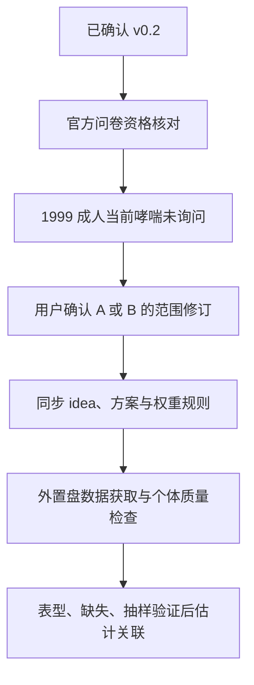

# 研究计划 v0.3 范围修订建议：成人当前哮喘的可用周期

状态：**用户已确认选择A并要求继续；本修订与已确认v0.2共同构成v0.3实施依据。**

当前阶段：实施阶段的数据资格gate触发方案修订。输入：已确认的[v0.2](2026-09-23-nhanes-asthma-ra-experiment-plan.md)和正式[元数据审核](../data/README.md)。输出：本修订建议。验证标准：成人可接受同义测量、权重适配、主次问题边界明确；用户只需确认此次有实质影响的改动。

## 原方案何处遇到限制

v0.2的主要问题是1999–2018、年龄20岁及以上成人的“当前哮喘与自报RA患病关联”。1999–2000的当前哮喘题MCQ030只询问1–19岁，成人被明确跳过。2001–2018的MCQ035则覆盖成人。

依据：[CDC 1999–2000 MCQ codebook](https://wwwn.cdc.gov/Nchs/Data/Nhanes/Public/1999/DataFiles/MCQ.htm#MCQ030)、[原始问卷第1页MCQ.015](https://wwwn.cdc.gov/nchs/data/nhanes/public/1999/questionnaires/spq-mc.pdf)、各周期字典见`docs/data/variable_dictionary.csv`。

这推翻的是“全十周期同一成人当前哮喘测量均可用”，并未推翻两病关联假设。成人曾被告知哮喘的MCQ010仍存在；它测量既往诊断史，和目前是否仍患病不同。不能把1999年的成人空白当没有哮喘、插补整周期当前哮喘，或将发作/喘鸣拼成相同结局。

## 建议选择A（推荐）

1. 主问题保持“两病共存”：2001–2018九周期、年龄20岁及以上，自报医生诊断RA与当前哮喘的患病关联。变量定义、非因果边界、预设混杂控制、缺失判定不变。
2. 在相同2001–2018周期比较“曾患哮喘”与“当前哮喘”，用于定义敏感性；另以1999–2018全十周期的曾患哮喘分析评估时间覆盖的扩展。扩展必须明确结局为诊断史，不能写为同时正在患两病。
3. 主分析访谈合并权重改为每人的两年访谈权重除以9；体检扩展如开展，则相应两年体检权重除以9。两年权重是每人在单周期代表的人口数，九个等长周期各占合并时期的九分之一。[CDC允许2001–2002起这样合并](https://wwwn.cdc.gov/nchs/nhanes/tutorials/weighting.aspx)。不得把1999–2002四年权重直接用于2001–2018。
4. 全十周期曾患哮喘扩展保留v0.2的混合权重规则：1999–2002用官方四年权重乘0.2，后续用两年权重乘0.1。解释为各自覆盖时期的汇总估计。
5. 原周期敏感性调整为主2001–2018与2003–2018、逐周期剔除比较；每个合并集合独立构造适配权重。
6. 哮喘发作/急诊仍是条件性次要分析，年份以当前哮喘可定义为前提，必须同时通过事件数和新增价值gate。当前查新未支持直接启动。

## 备选B：优先保留全部1999–2018

将主问题改为“自报RA与曾被医生诊断哮喘的关联”，以MCQ010定义哮喘诊断史；当前哮喘限2001–2018作补充。这改变主结局及临床解释，需要同步修订idea和计划。不能称作当前两病共存。

## 文档与执行影响

用户选择后，先将决定写入idea和方案版本记录，并同步正式方案的研究问题、周期、权重、敏感性和任务入口；再以更新后的正式文档为唯一科学输入继续实现。原始批准版本由Git历史保留，修订不能追溯伪记为早已批准。

Gate：verdict=pass（范围决策）；checked=用户明确确认A、原始问卷、字典和官方合并权重指南；weak point=真实联合病例数和缺失尚未知；next move=按确认范围重开数据资格gate。不存在模型结果驱动的范围选择，批准时尚未估计任何主关联。备选B未采用。
