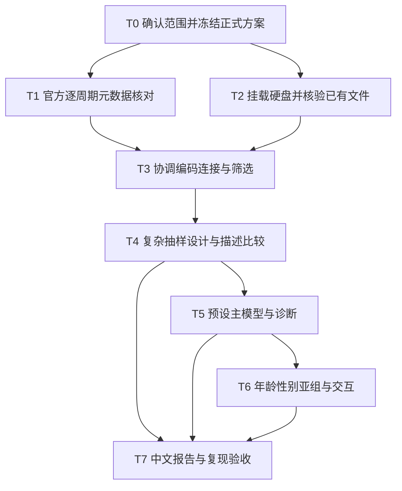

# 宝安区哮喘与类风湿关节炎实验分析方案

版本：v1.0｜日期：2026-09-28｜阶段：二｜状态：用户已确认并授权执行；数据获取方式修订为全新获取，禁止复用既有数据。

### 执行授权与数据获取修订

用户确认原文：“确认这份正式方案；确认后即可进入执行，不复用已有数据”。本次授权包括按本方案完成数据获取、核验、分析和报告。新的原始XPT及官方文档从CDC重新获取，使用移动硬盘独立新目录；不复制、软链接或读取旧参与者数据、旧派生数据、旧插补对象或旧结果作为本次输入。软件依赖可以使用已安装环境；代码仅在适用性核验后使用，不以代码复用偷带旧数据。该新指令替代下述原有数据复用安排，已同步修订全文。不需要再次确认同一执行授权。

## 问题目标

以已确认的原项目书范围和五项决定，完成可验证、可复现的NHANES横断面分析及中文报告。本文件为已确认的正式阶段二方案，规定任务、输入、输出、对照检查、失败解释和验收要求；不表示数据分析已执行。

### 输入文档与上下文隔离

本阶段只使用以下阶段一正式文件作为范围输入，并在生成前重新读取及校验其SHA256。没有使用阶段一聊天中未写入文件的决定，没有把旧仓库方案或结果当作新方案。

- `docs/research_ideas/2026-09-28-original-proposal-asthma-ra-idea.md`，v1.0，SHA256：`e0a27a1b625e92cd313f7b6b2003f4c17756f26dc16c2a344455780d97cc87a3`。
- `docs/research_ideas/2026-09-28-original-proposal-asthma-ra-analysis-plan-draft.md`，v1.0，SHA256：`ebfb01f4fb278bfbb9e105a22eea06ce9532deb5d51fbe1dd97a35f6a83236e5`。

原上传项目书的SHA256由阶段一文件记录为 `a0eb3090246b32b2e4f5441762cef04b8b417e4cfb758cbc42e5085d4def2391`。原书条款、用户补充要求、实施选择的对应关系见已冻结阶段一主文档。

输出文档：`docs/research_plans/2026-09-28-original-proposal-asthma-ra-experiment-plan.md`。

验证标准：原书每项分析均对应任务、证据、对照或反证检查、失败解释、交付和验收；已确认决定无遗漏；未来分析有明确停止规则；方案编制阶段未执行分析；现已授权按下列关口执行，未通过关口不得将结果作为研究结论。

### 已确认决定

| 内容 | 锁定设置 |
|---|---|
| 软件 | R与survey；记录由原书SPSS 25.0改为R；SPSS可用与否不再是先决条件 |
| 年龄亚组和分类比较 | 20—39、40—59、60—79岁 |
| BMI分类比较 | 低于18.5、18.5至低于25、25至低于30、30及以上 |
| PIR分类比较 | 低于1、1及以上，边界值1归入后组 |
| 回归连续量 | 年龄、BMI、PIR保留连续形式，主模型规划为线性项 |
| 调整顺序 | 未调整 → 年龄/性别/种族族裔 → 教育/PIR → BMI/吸烟 |
| 分析样本 | 四模型使用同一最终完整病例集合，均按复杂抽样估计 |
| 查新措辞 | 删除无充分依据的首次研究，不以新软件或新编码声称创新 |

除此表已确认决定外，本文件对自由度、比例区间、输出和停止规则作实施细化，已随本阶段二方案获确认。未增加敏感性分析、额外数据库、当前哮喘或急性发作结局、机制实验、机器学习、孟德尔随机化或生存分析。

## 已知量定义

本方案继承阶段一正式文档记录的原书要求与证据定位。NHANES为美国国家健康和营养检查调查；RA为类风湿关节炎；BMI为体质指数；PIR为贫困收入比；MEC为流动体检中心；PSU为主要抽样单位；OR为优势比。DEMO、MCQ、SMQ、BMX分别为人口学、健康状况问卷、吸烟问卷和体格测量模块。模块缩写不代表临床诊断。

### 从阶段一提取的研究主张

研究对象为1999—2018年NHANES十周期中20—79岁、两病及全部规定协变量完整有效的人群；结局是曾患哮喘，比较自报RA与明确无关节炎者。问卷未知不视为阴性，其他关节炎不并入对照。

| 编号 | 待验证主张 | 当前状态 |
|---|---|---|
| C1 | 十周期能够按原书重建两病、无关节炎对照及所需协变量 | 部分官方定义已核实，全部周期及BMI待核实 |
| C2 | 所选完整病例的人群特征和两组曾患哮喘比例可以可靠估计 | 未分析 |
| C3 | 七项协变量分别与哮喘及RA的分布有关联或无明显关联 | 未分析，均应报告 |
| C4 | RA与曾患哮喘存在调整后横断面关联 | 未分析，不预设方向 |
| C5 | 关联是否随年龄和性别不同 | 未分析，分组已确认，后续采用交互检验 |
| C6 | 讨论中的文献与机制解释具有相应证据边界 | 已确认删除无依据的首次；机制仅可讨论 |

证据标签沿用阶段一：direct evidence指对指定主张的直接证据；proxy evidence指替代测量证据；speculation指未验证解释；counterevidence指反对指定主张的证据。问卷是疾病自报状态的直接记录，但对临床确诊只是替代测量。模型可以提供横断面关联证据，不能提供时间先后、因果或机制证据。

### 变量定义与逐周期核验要求

以下为候选原始字段，全部周期正式核验通过后才能成为执行字典。字段大小写保留官方原名，并显式记录程序中的标准名。

| 分析内容 | 模块及候选字段 | 拟编码和有效性要求 |
|---|---|---|
| 受访者编号 | 各模块SEQN | 每模块非空且唯一；逐周期一对一连接；合并后检查跨周期唯一性 |
| 周期 | 文件周期、SDDSRVYR | 1999—2000至2017—2018，十周期；只作来源和质量核对，主模型不自动加入周期协变量 |
| 年龄 | DEMO RIDAGEYR | 20至79岁整数；上下界均纳入。80或85等高龄公开顶码不作真实年龄替换后纳入 |
| 性别 | DEMO RIAGENDR | 官方男性/女性有效编码；男性作参照。报告其问卷含义，不扩展为性别认同 |
| 种族及族裔 | DEMO RIDRETH1 | 十周期共同的五类：墨西哥裔、其他西班牙裔、非西班牙裔白人、非西班牙裔黑人、其他含多种族；白人作参照。不可把后期RIDRETH3直接替代早期共同变量 |
| 教育 | DEMO DMDEDUC2 | 成人五个有效等级，作为分类因子；大学毕业及以上作参照；拒答、不知道不作教育类别 |
| PIR | DEMO INDFMPIR | 有效非负连续值，官方上限编码按字典解释；0是有效值，不得误作缺失；主模型连续，表格<1/≥1分组已确认 |
| 曾患哮喘 | MCQ MCQ010 | Yes为1，No为0；拒答、不知道、未询问及无法解释的缺失分别记录，均不作0；不要求MCQ030或MCQ035完整 |
| 关节炎总题 | MCQ MCQ160A或官方小写后缀版本 | Yes/No按周期字典；类型题必须结合总题 |
| 关节炎类型 | MCQ190、MCQ191、MCQ195 | 按下表协调；RA和无关节炎是主比较，其他已知类型不并入0 |
| BMI | BMX BMXBMI | 优先采用官方BMI，结合身高体重、测量状态及注释核查；不默认使用自报BMI，不因极端值本身截尾或删除；不因其他身体测量缺失排除BMI有效者 |
| 吸烟 | SMQ SMQ020、SMQ040 | 从未：未达一生100支；既往：达到100支且目前完全不吸；当前：达到100支且每日或部分日吸。从未者后续题合法跳过不是缺失；冲突需核查。以从未作参照 |
| 体检权重 | DEMO WTMEC4YR、WTMEC2YR | 前两周期用四年权重，后八周期用两年权重；按下文缩放；正且有限 |
| 抽样设计 | DEMO SDMVSTRA、SDMVPSU | 官方伪分层、伪PSU字段完整；PSU嵌套在层中；不把不同层相同PSU码误认为同一群 |

### 十周期疾病编码核对表的初始状态

| 周期 | 曾患哮喘候选题 | 类型题候选字段 | RA肯定码 | 阶段一记录的证据状态 |
|---|---|---|---|---|
| 1999—2000 | MCQ010 | MCQ190 | 1 | 关键官方代码本已回查，逐项全字典与问卷审核仍待完成 |
| 2001—2002 | MCQ010 | MCQ190 | 1 | 已有本地元数据线索，需重新逐项回查 |
| 2003—2004 | MCQ010 | MCQ190 | 1 | 同上 |
| 2005—2006 | MCQ010 | MCQ190 | 1 | 同上 |
| 2007—2008 | MCQ010 | MCQ190 | 1 | 同上 |
| 2009—2010 | MCQ010 | MCQ191 | 1 | 关键官方类型编码及成人适用年龄已回查 |
| 2011—2012 | MCQ010 | MCQ195 | 2 | 关键官方类型编码及成人适用年龄已回查 |
| 2013—2014 | MCQ010 | MCQ195 | 2 | 已有本地元数据线索，需重新逐项回查 |
| 2015—2016 | MCQ010 | MCQ195 | 2 | 同上 |
| 2017—2018 | MCQ010 | MCQ195 | 2 | 关键官方类型编码、成人适用年龄和BMI说明已回查 |

以上不是“十周期全部通过”。正式表须对DEMO、MCQ、SMQ、BMX共40个周期模块组合核对题目、适用年龄、访问方式、跳题、编码、特殊缺失、权重、版本及来源。若某周期缺乏所需测量，先停止该项协调并提交影响及最小修订，不按同名字段硬拼。

## 未知量定义

当前未知：实际可用BMX文件、各文件当前哈希、连接异常、样本量、各变量缺失情况、有效设计自由度、模型是否收敛、亚组稀疏程度、所需峰值内存和运行时间。所有结果表只能在确认并执行后填入；本方案不给模拟数值占位。

## 每个符号解释

- i：一名受访者的编号；c：一个两年调查周期。
- w_i：该受访者用于1999—2018合并分析的体检权重；W4_i：其官方WTMEC4YR；W2_i：其官方WTMEC2YR。
- D_i：是否属于最终合格完整病例子总体，是为1、否为0。
- Y_i：曾患哮喘，是为1、否为0；未知者不进入最终子总体。
- R_i：自报RA为1、明确无关节炎为0；其他状态不进入主比较。
- g：RA组或无关节炎组；I(R_i=g)：属于该组时为1、否则为0的指示量。
- p_i：给定RA与模型协变量后，曾患哮喘的模型概率；p帽_g：组g的估计加权比例。
- X_i：该受访者全部预设协变量构成的一组数值，分类协变量展开为参照编码；β_X为对应的一组回归系数。
- β_0：截距；β_R：RA对应的回归系数；β_X转置乘X_i表示逐项系数与变量值相乘后相加。
- log：自然对数；exp：自然指数函数；Σ：对调查记录求和；×：相乘。
- SE：按复杂抽样设计计算的标准误；ν：用于推断的有效设计自由度；t_0.975,ν：对应自由度下t分布的97.5%分位数。
- M0、M1、M2、M3：四个预设模型编号，不是四个不同分析人群。

## 公式从哪里来

1. 体检权重来源于CDC体格测量说明与合并周期教程，不能从访谈权重直接换名字得到。
2. 加权比例是组内“有哮喘的加权人数”除以“组内全部加权人数”。
3. Logistic模型假设对数优势可以用协变量线性组合表示。它是需要检查的统计建模选择。
4. OR来自同协变量条件下两个组的优势之比；区间来自设计方差和预定的t参考分布。

## 一步一步推导

### 1 从时间范围得到合并权重

1999—2018共20年，其中1999—2002覆盖4年，余下8个周期各覆盖2年。官方提供前4年的联合体检权重，因此前两周期每条记录采用 `w_i = (4/20) × W4_i = 0.2 × W4_i`；2003—2018每条记录采用 `w_i = (2/20) × W2_i = 0.1 × W2_i`。前两周期不能再各除一次2，也不能全部简单采用两年权重除10。这是CDC一般合并规则在本研究年份上的应用。[CDC权重教程](https://wwwn.cdc.gov/nchs/nhanes/tutorials/weighting.aspx)

### 2 从调查设计得到子总体分析

在有效MEC权重和官方设计变量齐备的较宽体检调查样本上构建设计，再由D_i限定年龄、疾病与完整病例子总体。年龄和性别亚组继续从该设计作子总体分析。保留域外记录所提供的设计信息；不得先删除所有域外记录再当作独立样本构建设计。采用Taylor线性化方差；读取实际层和PSU计算自由度，不沿用旧项目的139。调查周期与公开伪分层编码的关系须按官方文件核验，不无依据拼接新层号。[CDC方差教程](https://wwwn.cdc.gov/nchs/nhanes/tutorials/varianceestimation.aspx)

### 3 从有效分母得到加权患病比例

`p帽_g = Σ[w_i × D_i × I(R_i=g) × Y_i] / Σ[w_i × D_i × I(R_i=g)]`。

先限定完整病例与组别，再将曾患哮喘者的权重相加，最后除以组内全部权重。实际实现只对病史已知的域内记录求比例，不能让域外未知值在程序中错误传播。报告实际人数和事件数，同时报告加权百分比及区间。权重和不是实际受访人数；合并权重表达合并时期平均人口结构，不是20年累计病例数。

### 4 从模型得到OR和区间

完整模型为 `log[p_i/(1-p_i)] = β_0 + β_R × R_i + β_X转置 × X_i`。

固定相同的协变量值时，RA组和无关节炎组的对数优势只相差β_R；指数变换得到两组优势之比，因此 `OR = exp(β_R)`。系数的95%区间先计算 `β_R ± t_0.975,ν × SE(β_R)`，再将上下限分别指数变换得到OR区间。符号±表示分别相加和相减得到上、下限。

本方案单系数推断采用相应分析域设计对象的设计自由度ν，由survey的degf取得，并核验其与该设计中的PSU及分层支持一致；采用设计自由度的t检验及Wald区间。主模型M0—M3使用同一设计自由度，各亚组记录各自的设计自由度。联合交互项采用设计Wald F检验，显式使用相应分析设计自由度作为分母自由度，分子自由度为被联合检验的独立系数个数。不得混用普通独立样本标准误、默认无限自由度和设计校正P值；实际函数调用须显式设置并留日志。

### 5 预设模型与亚组

| 模型 | 调整内容 | 地位 |
|---|---|---|
| M0 | 只有RA | 未调整关联，但仍按复杂抽样估计 |
| M1 | M0 + 年龄、性别、种族及族裔 | 人口学调整 |
| M2 | M1 + 教育、PIR | 增加社会经济变量 |
| M3 | M2 + BMI、吸烟 | 全部七项协变量，主要关联结果 |

模型次序与共同样本已确认。四模型统一使用M3所需的完整病例集合，避免人数变化混入“调整效果”。年龄、BMI、PIR保留连续形式，在主模型中按连续线性项规划，分类变量作为因子。不自动采用旧项目年龄样条，不按P值逐步筛选；非线性或拟合问题触发方案复核，未经确认不改变模型后仍声称预设结果。

年龄已确认20—39、40—59、60—79岁；这是预先指定的等跨度分组。性别按官方男性与女性。年龄层内仍调整连续年龄及其余协变量；性别层内移除恒定性别项，保留其余六项。年龄交互模型在连续年龄及全套协变量基础上加入年龄组主效应、RA与年龄组乘积项，对两个乘积项作整体检验；性别交互模型加入RA与性别乘积项。报告的是乘法优势尺度的交互，不声称任何尺度都存在差异。亚组OR来自各域的M3对应模型；交互P值来自合并模型，二者来源注明。

## 每一步为什么成立

### 6 claim-to-evidence任务矩阵

C1至C6为下表之前已列明的主张编号；T0至T7为未来子任务编号。

| 主张 | 任务 | 输入 | 输出 | 对照或反证检查 | 失败解释 |
|---|---|---|---|---|---|
| C1可构建性 | T1元数据，T2文件，T3协调 | 正式计划、官方40个周期模块文档、经核验原始文件 | 字典、来源表、连接及筛选记录 | Yes/No/未知逻辑；早晚RA编码；官方频数；编号唯一 | 不可测或文件不符时不能形成有效样本 |
| C2描述 | T4设计与描述 | 宽MEC设计及合格域 | 特征、分母与加权比例 | 比例与组内权重手工汇总交叉核验；全部类别闭合 | 分母或设计错时无效；稀疏时不稳定 |
| C3协变量比较 | T4 | 固定分类与主样本 | 两病各一套设计校正检验 | 全类别总体检验；不以显著性改切点 | 样本稀疏则检验不可解释，不等于无关系 |
| C4主关联 | T5 | 同一主样本与预设四模型 | 回归表及诊断日志 | 有效事件/非事件，数值收敛，系数可识别，独立核对公式 | 分离、秩不足或精度差则标不可可靠估计 |
| C5亚组 | T6 | 同一设计和预设年龄/性别组 | 亚组表、森林图、交互检验 | 交互整体检验及各层四格频数 | 无交互证据不等于各层等效；稀疏不能强拟合 |
| C6查新与解释 | T7 | 结果、诊断、文献原文 | 中文讨论、结论、引文核验表 | 区分既往研究结局、测量限制、替代解释 | 不支持“首次”或机制证实时删除相应措辞 |

这是一项观察性二次分析，不引入实验阳性/阴性对照。阳性与阴性编码控制分别是字典规定的明确Yes与No；技术控制包括文件哈希、官方频数、连接和重复汇总。随机置换检验不是原书要求，本次不加入；未来如编写分类逻辑测试，仅用带清晰标签的逻辑测试夹具，不将其作为研究数据或结果。

### 7 数据寻找与原始资料管理

从CDC重新获取十周期DEMO、MCQ、SMQ、BMX四模块官方文档，完成测量资格审核后，全新下载40个XPT文件到移动硬盘独立目录。禁止以旧文件、旧清单哈希或旧派生资料代替本次获取与校验。不覆盖原文件，不增加其他数据库或实验资料。记录官方页面列出的文件大小；以估计下载量和可用空间核对后实施。

所有原始数据下载均在实际挂载移动硬盘；本地只放计划、代码、汇总表和报告。保存官方来源网址、检索时间、字节数、SHA256、周期、模块、官方版本及全新获取标记。移动硬盘未挂载、容量不足或来源不可确认时停止下载，不能回退系统盘。阶段一已查阅的网页作为来源线索保留；编制阶段未下载参与者数据文件；执行阶段重新获取全部来源文档和数据。

### 8 连接与缺失状态

以DEMO为每周期基础表，逐一左连接MCQ、SMQ、BMX；连接前检查SEQN，连接后记录匹配、未匹配、孤立记录、行数变化。禁止无解释的多对多连接或静默去重。跨周期合并前再次检查键和来源周期。

保留原始值与派生缺失原因：合法跳题、年龄不适用或未问、拒答、不知道、模块未匹配、实际空值、逻辑冲突。只有依据问卷能明确确定的状态才赋病史0或1。明确无关节炎者的类型题合法缺失不违反“疾病信息有效”；有关节炎但类型未知者不能放进对照。吸烟状态同理。对曾患哮喘的判断不附加未要求的“当前哮喘题完整”条件。

BMI使用官方有效值及注释，不默认截尾、缩尾或用身高体重重算补缺。部分周期孕妇BMI处理及披露规则需逐周期核实；原书没有排除孕妇，不自行增加此项排除。有明确有效BMI则依原标准纳入并讨论测量限制；官方缺失则按所需协变量缺失处理。如发现必须修订，先报问题及最小建议。

### 9 样本筛选与缺失诊断

固定筛选顺序：十周期DEMO全部记录 → 年龄20—79 → 有效MEC权重与设计变量 → 哮喘有效 → RA或明确无关节炎 → 全七项协变量完整有效 → 主分析样本。连接检查属于此前的数据质量关口。

每步记录进入人数、该步互斥排除人数、剩余人数。关节炎分支单列其他已知类型、类型不明、拒答、不知道、实际缺失与矛盾；同一人只计入一个顺序排除原因。同时提供允许重叠的逐变量缺失表，不能把重叠缺失人数相加冒充总排除人数。

协变量排除顺序为性别、种族、教育、PIR、BMI、吸烟；年龄已经处理。每步由程序输出数据表，流程图自动读取该表。完整病例选择偏倚应在局限中说明，NHANES权重不自动校正这次分析特有的变量缺失；不据此自动改为插补。

### 10 描述与协变量比较

主特征表分为全样本、RA、无关节炎三列组；分类量给实际人数和加权百分比；连续量给加权均值与标准误，分布明显偏斜时补充分位数描述并标明算法。另表给两组曾患哮喘的实际病例数、分母、加权比例及95%区间。比例区间采用survey的svyciprop，指定logit方法与相应域的设计自由度；报告算法。比例为0或1、设计支持不足或算法失败时保留实际人数与点估计，区间标为无法可靠估计，不使用零宽区间，也不静默更换算法。

为落实原书两套卡方比较，年龄、BMI、PIR使用确认后的固定组别，其余按既定类别；逐项分别与曾患哮喘、RA交叉，使用Rao–Scott设计校正检验及软件对应的F形式，报告自由度与双侧P值，不用普通Pearson检验套用权重人数。BMI分界依据[CDC成人BMI分类](https://www.cdc.gov/bmi/adult-calculator/bmi-categories.html)；PIR=1是其贫困比值的定义边界。补充报告连续描述不等于自动增加新的检验。

以M3的RA系数为主要检验；其余模型展示调整变化，协变量比较和亚组属预设辅助分析。保留原书双侧0.05阈值，完整报告P值、效应和区间，讨论多重比较问题；不从众多检验中只选显著项作结论。

### 11 模型与估计质量

检查实际四格人数、每层及每PSU的支持、事件数与非事件数、设计自由度、模型矩阵秩、分类空水平、连续量的相关和共线性指标、完全或准完全分离、迭代收敛、极端系数和标准误、区间宽度及可识别性。共线性指标只作数值诊断，不能用它机械删除原定协变量。

小单元数是预警，不能仅靠统一“每格至少5人”保证复杂抽样估计可靠；同样不能因某格不足5人就自动换普通Fisher检验。若总体或亚组不可估计，在表和森林图标明“无法可靠估计”及原因，保留样本数。零事件比例不输出误导性的零宽区间。

孤立PSU、设计自由度不足、权重异常先停止相关推断并检查原因；未经明确方案不启用静默修正。不得通过丢弃协变量、合并年龄组、改参照组、惩罚回归或挑模型来强行获得有限或显著结果。

### 12 已确认R实施及原书软件的方法对应

原书写明SPSS 25.0，用户现已明确确认采用R与survey。阶段一环境查询曾检查到R 4.5.1及仓库独立库中的survey 4.5，未拟合模型；执行时再次验证并锁定实际版本。下表保留为软件变更的方法对应说明，不设置双软件分析或SPSS复算要求，报告只写实际使用的软件。

| 分析环节 | SPSS Complex Samples方向 | R survey方向 | 必须对齐的内容 |
|---|---|---|---|
| 抽样设计 | CSPLAN分析计划文件 | svydesign | 权重、分层、层内PSU、方差方法 |
| 子总体 | 各CS过程的子总体指定 | 构建设计后subset | 主样本及亚组资格，保留设计结构 |
| 描述 | CSDESCRIPTIVES、CSTABULATE | svymean、svyby及设计比例区间函数 | 分母、缺失、区间算法、自由度 |
| 分类检验 | CSTABULATE设计校正关联检验 | svychisq的设计校正F检验 | 检验形式、自由度及类别 |
| Logistic | CSLOGISTIC | svyglm的quasibinomial及logit连接 | 结局事件编码、因子参照、公式、标准误和区间 |
| 交互 | 模型乘积项和联合Wald检验 | 乘积项和regTermTest等设计检验 | 联合项、尺度、分子分母自由度 |

此表是方法对应，不承诺不同软件默认选项完全相同。普通SPSS `WEIGHT BY` 后运行普通Logistic，不能替代CS设计方差。SPSS来源：[25版文档目录](https://www.ibm.com/support/pages/ibm-spss-statistics-25-documentation)、[Complex Samples说明](https://www.ibm.com/products/spss-statistics/complex-samples)、[Logistic过程说明](https://www.ibm.com/docs/en/spss-statistics/32.0.0?topic=samples-complex-logistic-regression)。后一页面为现行版本说明，25版细项以实际25版手册与软件验证为准。

### 13 最小与完整集合及性能约束

最小可行集合：T0—T7均必要，覆盖原书的描述、两套协变量比较、模型和两类亚组，任何不可估计项以原因交付。完整集合是在同一范围内补齐全部质量核对、字典、来源和复现验收；没有自动附加分析。敏感性分析目前为空。

采用逐周期读入、只保留所需列、单进程建模和汇总输出；不运行插补或高成本重采样。阶段一文档记录的Mac内存和处理器参数查询受环境限制，尚未取得，故不虚报容量或完成时间。执行前核对内存、磁盘空间与代表性单周期读入的峰值用量，再决定是否分块。暂不需要GPU或远程计算；新安装与下载按已确认方案处理。

### 14 子任务依赖图

该图是未来依赖说明，不表示任务已经执行，也不表示已授权并行代理。

### 15 子任务验收与失败行动

下列为执行阶段验收标准；阶段一范围、五项决定及本阶段二正式方案均已确认，T0写入执行授权并验证环境后通过。T1/T2仅有阶段一文档记载的初步核对，T3—T7尚未执行。

| 关口 | checked及通过标准 | weak point与失败条件 | verdict规则与next move |
|---|---|---|---|
| G0 对应T0 | 已确认原件、分组、模型、软件；正式文档含全部决定 | 决定只在聊天中或未获确认 | 未满足为needs evidence；补写确认后pass |
| G1 对应T1 | 40个周期模块组合中每个必需变量都具官方语义及适用性证据 | 编码含义不一致、某周期未测 | 可最小修订则revise并确认；无法测量且拒绝修改则stop |
| G2 对应T2 | 硬盘真实挂载；文件来源、字节、哈希和内容一致 | 缺文件、哈希变化、下载源不明 | needs evidence；仅经授权补齐核验后pass |
| G3 对应T3 | 唯一键、人数闭合、合理跳题、未知与其他关节炎分开 | 静默去重、未知当0、排除数不闭合 | revise，修复记录后再审，不进入统计 |
| G4 对应T4 | 体检合并权重、官方分层PSU、子总体、分母核验通过 | 设计自由度或稀疏支持不足 | 可靠者pass；无效设计stop；部分指标needs evidence |
| G5 对应T5 | 四模型同样本，七协变量落实，模型可识别且收敛，报告完整 | 分离、矩阵秩不足、严重精度不足 | 无法估计项如实交付，模型变更先revise |
| G6 对应T6 | 固定组别，各域人数和精度，两个交互检验清晰 | 将一组显著另一组不显著当作交互 | revise解释；不可估计项记stop，不强行出OR |
| G7 对应T7 | 表图正文数字逐项一致、全结果报告、Word/PDF每页检查、环境与代码齐全 | 硬编码旧值、缺图、越界因果或首次表述 | revise至通过，保留变更记录 |

### 16 交付与复现

| 交付 | 内容及验收 |
|---|---|
| 中文Word和PDF | 背景、目的、方法、结果、讨论、局限、结论；所有页检查表格跨页、字体、图和编号 |
| 图1 | 样本筛选流程；互斥排除数逐步闭合，来自最终筛选表 |
| 表1 | 全样本及两组人群特征，实际人数、加权比例或均值 |
| 表2 | RA和无关节炎两组曾患哮喘加权比例、病例/分母、95%区间 |
| 表3及表4 | 七协变量分别与哮喘、RA的设计校正比较；可在报告中分正文和附表，但不得漏项 |
| 表5 | M0—M3的样本数、事件数、调整变量、OR、95%区间、P值 |
| 表6和森林图 | 年龄与性别亚组人数、病例数、OR及精度；整体交互P值来源明确；不可估计原因保留 |
| 复现包 | 变量字典、来源与哈希清单、筛选及设计核验、诊断、最终代码、依赖版本、复现说明、实际运行日志 |
| 其他分析 | 当前没有；仅交付之后另行确认的项目 |

图表数量是本次交付组织建议，不是原书指定数字。表1、表2和模型主表均明确同一完整病例总体；检查缺失用的较宽样本如单独报告，注明不同分母，不混作主结果。

全部正文数字通过机器可读结果表的稳定字段读取，或建立逐项核对表。记录计划版本、代码提交、输入文件哈希、输出哈希和运行时间；不粘贴旧项目结果。执行前保留当前仓库已有文件，另设 `outputs/original_proposal_20260928_v01/`，目前仅有文档及版本记录，数据与结果目录在获准后建立；个体数据继续留在移动硬盘。复现验收须区分读入旧结果、从中间表重算、从核验原始文件重跑，不混称已完成完整复现。

### 17 官方与文献来源索引

以下网页与核对状态均继承自阶段一正式文档；阶段二未新增网页检索；尚未完成的周期明确标在前表。链接供后续正式字典使用，不能代替原始文件核验。

- [1999—2000 MCQ](https://wwwn.cdc.gov/Nchs/Data/Nhanes/Public/1999/DataFiles/MCQ.htm)：MCQ010、MCQ160A、MCQ190关键定义。
- [2009—2010 MCQ](https://wwwn.cdc.gov/Nchs/Data/Nhanes/Public/2009/DataFiles/MCQ_F.htm)：MCQ191类型编码。
- [2011—2012 MCQ](https://wwwn.cdc.gov/Nchs/Data/Nhanes/Public/2011/DataFiles/MCQ_G.htm)：MCQ195类型编码变化。
- [2017—2018 MCQ](https://wwwn.cdc.gov/Nchs/Data/Nhanes/Public/2017/DataFiles/MCQ_J.htm)：后期类型编码与成人资格。
- [1999—2000 DEMO](https://wwwn.cdc.gov/Nchs/Data/Nhanes/Public/1999/DataFiles/DEMO.htm)：人口学与权重字段来源页，完整字段资格待逐项审核。
- [2017—2018 BMX](https://wwwn.cdc.gov/Nchs/Data/Nhanes/Public/2017/DataFiles/BMX_J.htm)：实测BMI、质量注释及采用体检权重的说明。
- [CDC权重教程](https://wwwn.cdc.gov/nchs/nhanes/tutorials/weighting.aspx)、[CDC方差教程](https://wwwn.cdc.gov/nchs/nhanes/tutorials/varianceestimation.aspx)：周期合并及子总体推断。
- [CDC成人BMI分类](https://www.cdc.gov/bmi/adult-calculator/bmi-categories.html)：已确认BMI分组依据。
- [IBM SPSS 25文档目录](https://www.ibm.com/support/pages/ibm-spss-statistics-25-documentation)：该版本Complex Samples模块文档条目；阶段一PDF正文访问失败，不声称已逐条核验25版全部语法。
- [Baljet等2023原文](https://www.nature.com/articles/s41533-023-00350-x)：已有NHANES哮喘急性发作与RA等共病研究，支撑查新边界，不能用其结果替代本次分析。

### 18 任务输入输出和追溯文件

以下为执行后的拟交付文件，当前未创建内容或填入样本数。表中的名称在独立输出目录下使用；个人级数据和派生数据只能放实际挂载的移动硬盘。

| 任务 | 输入和依赖 | 输出及最低验收 |
|---|---|---|
| T0 方案与环境冻结 | 本方案确认记录、阶段一哈希 | plan_lock.json、environment.txt、软件变更记录；版本可定位，输入哈希一致 |
| T1 元数据 | 确认方案、四模块各周期官方问卷与代码本 | variable_dictionary.csv、cycle_coverage.csv、metadata_review.md；必需变量语义、年龄和跳题无未解释缺口 |
| T2 文件核验 | 硬盘新目录、T1所需文件名与官方来源 | input_manifest.csv、input_integrity.json；40个XPT全新获取并逐文件校验，下载时间和来源可追溯 |
| T3 连接与筛选 | T1字典、T2通过的文件 | join_checks.csv、phenotype_qc.csv、sample_flow.csv、missingness.csv；键唯一、排除人数闭合、原始与派生状态可回查 |
| T4 设计与描述 | T3数据与主样本标记 | design_audit.csv、characteristics.csv、asthma_prevalence.csv、covariates_asthma.csv、covariates_ra.csv；权重设计及统计分母一致 |
| T5 主回归 | 同一主设计和M0—M3公式 | regression.csv、model_diagnostics.csv；人数一致、七协变量完整、估计与诊断相符 |
| T6 亚组 | T5主分析通过、预设分组 | subgroups.csv、interaction_tests.csv、subgroup_forest.pdf及图片；逐组样本与事件数、区间、不可估计原因、交互来源完整 |
| T7 报告 | T1—T6汇总及诊断、核验后的文献 | 中文report.docx、report.pdf、sample_flow图、正文数字核对表、复现说明及输出哈希；逐页视觉检查与数字一致性通过 |

正式代码将另建命名目录与入口，不覆盖旧脚本；旧代码仅在逻辑及适用性逐项核验后复用。主结果表至少包括分析总体、模型、变量或组别、实际人数、哮喘事件数、估计值、上下限、P值、自由度、方法、可估计状态及原因，避免仅保存格式化字符串。

### 19 混杂处理与结果解释

| 问题 | 处理或解释 |
|---|---|
| 已测混杂 | 最终模型固定调整年龄、性别、种族族裔、教育、PIR、BMI、吸烟；不按单因素显著性筛选 |
| 粗分组残余混杂 | 分组用于指定的分类比较与亚组；主模型三项连续变量保留连续值，年龄亚组内仍调整连续年龄 |
| 未测混杂与诊断机会 | 报告局限，不能声称七项调整已消除全部混杂；不自动增加额外协变量 |
| 完整病例选择 | 按规定排除并透明报告缺失；设计权重不能自动修复分析特有的缺失选择偏倚 |
| 疾病测量 | 自报医生诊断不等于临床核实；疾病误分类和回忆误差可能影响关联 |
| 原定对照范围 | 排除其他关节炎后，结论仅针对RA与无关节炎的比较，不推广为所有非RA人群比较 |
| 跨时期变化 | 报告合并周期局限；周期是来源核对字段，不擅自加入主模型调整。必要修订另行确认 |

M3估计及其区间若支持与无关联不同的优势比，可表述为调整后的横断面关联；若估计接近无关联且精度较高，可说未见明显关联。若区间较宽，只能说明证据不确定。没有预设临床等效界值，因此不能把不显著结果写成已证明等效或没有任何关联。负向结果同样完整报告。

年龄或性别差异以合并模型的交互检验评价，不能由一组显著、另一组不显著推出。所有亚组估计与交互检验均呈现；低精度或不可估计不通过改变切点、删协变量或替换对照来修复。机制解释始终标为speculation，原书引文需核验到原文支持的具体论点。

### 20 完备性与阶段审查

| 阶段二要求 | 本方案位置 |
|---|---|
| 1 从idea提取claim | 已知量定义中的研究主张 |
| 2 claim-to-evidence矩阵 | 第6节 |
| 3 每claim任务 | 第6节与第18节 |
| 4 每任务输入 | 第6节与第18节 |
| 5 每任务输出 | 第16节与第18节 |
| 6 阳性阴性随机技术对照 | 第6节，明确随机研究对照不适用且不新增置换分析 |
| 7 混杂与排除方法 | 第8至11节及第19节 |
| 8 失败解释 | 第6节、第11节、第15节 |
| 9 最小可行集合 | 第13节 |
| 10 完整集合 | 第13节及第16节 |
| 11 数据寻找 | 第7节 |
| 12 资源与Mac约束 | 第13节 |
| 13 统计方法及判定 | 推导第1至5节、第10至12节 |
| 14 支持削弱否定idea | 第19节与研究主张矩阵 |
| 15 子任务列表 | 第18节 |
| 16 Mermaid DAG | 第14节 |
| 17 每任务验收 | 第15节与第18节 |

## 一个最小例子

不使用模拟数值：如果年龄合格的明确无关节炎者BMI缺失，即使疾病状态和其余协变量都明确，也不能进入原方案完整病例主分析。M0也应使用与M3相同的完整病例集合，所以不会因为M0公式中没有BMI便将此人加回。这样M0与M3的变化主要反映模型调整，而不是换了一批人。

## 最后总结

当前阶段：二已获确认，进入第三阶段执行。

| 审查项 | verdict | checked | weak point | next move |
|---|---|---|---|---|
| 阶段一输入 | pass | 两份v1.0正式文件及哈希，五项决定齐全 | 无新的范围决定从聊天隐式带入 | 保持来源冻结 |
| 方案文档覆盖 | pass | claim、任务、对照、失败解释、依赖图、交付与17项要求逐项对应 | 这是文档覆盖检查，不是数据或模型验证通过 | 提交用户审核 |
| 数据可实施性 | needs evidence | 继承阶段一的文件与测量缺口 | 移动硬盘现状、BMX和全周期字段尚未核验 | 执行获准后先做T1/T2 |
| 进入第三阶段 | pass | 用户已确认方案并授权执行，要求不复用已有数据 | 后续实际数据与模型关口仍须核验 | 全新获取官方资料并按关口执行 |

核心结论：按原定十周期、曾患哮喘、RA对无关节炎和20—79岁完整病例实施，采用已确认的分组、四模型及R软件。未解决问题是数据和执行资格，不再重复询问已确认的五项决定。本方案已获用户确认，现以本文v1.0作为执行范围依据。原始数据仅在移动硬盘全新获取与保存；不复用既有数据；异常按各关口停止或修订。
