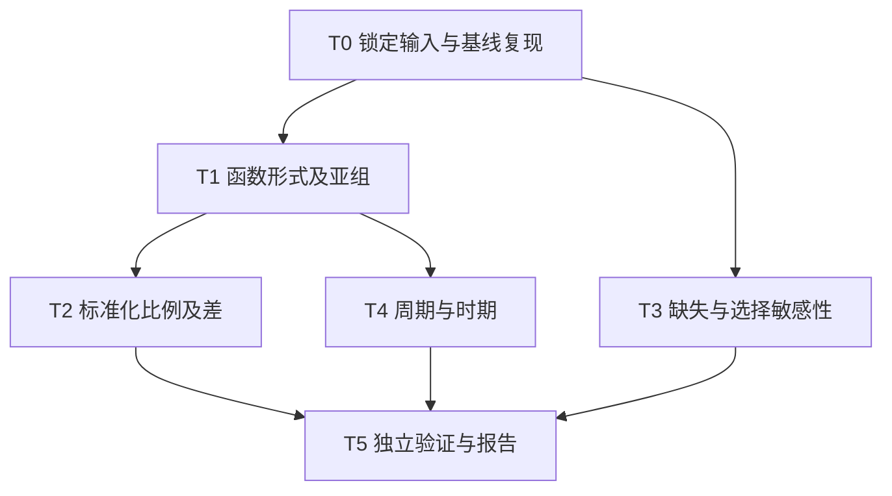

# NHANES哮喘与类风湿关节炎原分析补充方案

版本v1.0；2026-09-29。用户已授权“补充原分析吧，你执行就好”。本方案在新模型执行前制定，属于已授权路线的实施细化。原报告、稿件、定义与主结果保留不变。

## 阶段与输入输出

阶段二输入仅为 `docs/research_ideas/2026-09-29-asthma-ra-supplement-authorized-idea.md` 及其中正式引用的思路与原方案。阶段三以本文件为实施依据。输出目录为 `outputs/supplement_original_20260929_v01`，新代码为 `scripts/supplement_original_v1`。个体数据、模型及逐人诊断仅写入移动硬盘原项目根目录下的新 `supplement_20260929_v01` 子目录。

验证标准：输入和封存校验；同样本基线回归复现；复杂设计方差；模型数值资格；所有预设结果报告；标准化与选择权重不确定性校验；Word/PDF数字及逐页排版检查。

## 1 提取的claim与2验证矩阵

| Claim | 任务 | 证据输出 | 对照或反证检查 | 失败解释 |
|---|---|---|---|---|
| C1 函数形式不会明显改变主要解释 | T1自然限制样条补充 | 回归、非线性联合检验、年龄/性别亚组及交互 | 原线性M3同样本重算；有限预设替代 | 模型或估计变化须降级稳健性，不能挑显著模型 |
| C2 可解释标准化患病比例及差值 | T2标准化预测 | 两比例、绝对差、设计区间 | 组间协变量支持、协方差独立核验 | 不能作因果效应；外推过强时明确限制 |
| C3 完整病例选择影响可评估 | T3缺失诊断与选择加权 | 纳入/排除特征，缺失模式，补充OR | 完整病例；选择概率、权重尾部、联合估计方差 | 依赖给定已观察核心变量后选择可忽略的强假设，不能验证缺失机制 |
| C4 跨时期结构不会主导结果 | T4周期调整与时期比较 | 周期调整模型、两个十年域估计、交互 | 未调整周期的同形式模型；样本和设计支持 | 时期差异是重复横断面差异，不是随访或趋势因果 |

## 3至5 任务输入与输出

T0读取原方案此次全新获取资料的清单并核验40份XPT与已存分析框架的记录。输入框架 `derived/analysis_frame.rds`。基线重算与封存M3一致后才继续。若派生框架不具有既往锁定哈希，记录当前哈希并由原始字段独立重建核心资格核验，不把新哈希冒充历史校验。

T1—T4使用同一宽MEC设计后取子总体；原完整病例35128人，疾病资格通过但协变量可缺失者39121人。输出只含汇总CSV、图、方法记录和报告。新增模型对象及逐人预测只保存在外盘，不复制到本机交付包。

## 6 对照与7混杂

技术对照为原M3复现、源数据哈希、独立线性化方差及标准化计算。不存在本研究随机或阳性实验对照；不生成模拟研究结果。所有原七协变量固定保留。年龄、BMI、PIR连续；不按P值选变量。记录未知状态与有效跳题原有处理。原始疾病未知、其他关节炎不因选择分析被重新纳入。

## 8 失败解释

不收敛、秩亏、分离或设计方差无法可靠计算的模型保留样本量及失败原因，不报告虚假的有限区间。诊断异常首先检查实现；只修正代码错误，不根据结果换节点、删周期或改人群。对于可估计但宽区间、残余曲线或弱支持，报告限制而不是把它们归类为通过生物学验证。

## 9 最小集合与10完整集合

最小集合为T0—T4及T5交付，不新增其他探索。完整集合含所有诊断、核验与结果来源追溯。样条和时期设置均固定如下；不再自动加入其他形式。

## 11 数据策略

不下载新数据库或新增周期，不复用历史不合规数据；使用2026-09-28原方案全新取得的十周期文件。原始及派生个体资料留在 `/Volumes/Elements/NHANES_original_proposal_20260928_fresh_v1`。本轮原始文件核验不修改源文件。

## 12 资源

单机R单进程，约10万条宽框架；保留汇总时及时释放中间矩阵，避免保存多个宽设计副本。不使用GPU或高成本重采样。模型执行日志记录实际时间和环境。文档渲染采用已配置运行环境。

## 13 统计方法

### 13.1 设计及推断

沿用WTMEC4YR×0.2和后八周期WTMEC2YR×0.1、SDMVSTRA和层内SDMVPSU。宽设计后取原完整病例或疾病资格域。主域自由度153；亚组使用实际设计自由度。Taylor线性化，双侧检验；OR采用系数与设计标准误的t区间。辅助检验完整报告，不作“跨0.05即稳健失败”的机械判断。

### 13.2 函数形式固定

B0：原M3，年龄、BMI、PIR均线性。
B1：年龄和PIR采用三节点限制性立方样条，BMI线性；每变量包含线性项及一个非线性基函数。
B2：B1基础上BMI亦采用同类样条。
B3：B1基础上增加10水平调查周期因子。

每变量节点取原完整病例未加权第10、50、90百分位（R quantile type=7），只依自变量分布确定，写入knots.csv。所有补充域使用同一组节点；不搜索最显著节点，不删极值。若节点重复导致样条不可定义则报告不可实施，不临时切点。PIR最高5保留顶码含义。三节点样条仅是有限灵活度的敏感性模型，不声称捕捉全部非线性。

B1联合检验年龄/PIR非线性项，另报各单项；B2检验BMI额外非线性项。以设计Wald F检验实现。原年龄3组、性别2组在B1下重复；年龄组内继续调整连续年龄，性别组内移除恒定性别项。合并B1模型含年龄组主项与RA乘积项作年龄交互；性别交互含RA×性别。

### 13.3 标准化患病比例

对B0、B1、B3，以原完整病例的加权协变量分布为标准人口，分别令RA编码为0和1进行预测并加权平均，报告两比例及比例差；这是调整后的关联描述，不是改变疾病状态的干预效应。概率区间采用logit转换、差值用恒等尺度t区间。

方差同时包含模型参数估计及目标协变量分布的抽样波动。以堆叠估计方程的线性化贡献计算设计总量协方差，保留父设计。用独立PSU汇总协方差核对；不只把回归系数抽样方差当作全部方差。

支持检查：报告各RA组连续量的加权分位数、预设分类单元格及事件数，另用仅协变量预测RA的诊断模型检查预测概率共同支持。该诊断不作匹配或治疗权重，不因支持诊断删人；若显示重要外推，结果标为模型依赖并解释限制。

### 13.4 完整病例选择

疾病资格域39121人中，比较纳入/排除者的年龄、性别、种族、哮喘、RA和周期分布；其余协变量给可观察者均值/比例及各自分母、缺失人数，不能把缺失类别当成真实教育等状态。给完整缺失模式表及病例纳入概率。

预设一个补充选择概率模型：完整病例指示为结局，预测变量为两病状态、年龄线性及上述年龄非线性项、性别、种族、调查周期。这些变量在该域完整。采用原复杂设计加权Logistic估计完整病例概率。选择敏感性结果在完整病例中以原体检权重除以该概率，拟合B1公式，标记B4。不截断或数据驱动修剪权重；报告概率范围、权重倍数、极端权重和有效样本量指标。若存在接近零的概率导致严重不稳定则停止该项可靠推断。

此方法要求：给定模型所含完整变量后，缺失选择与完整协变量/结局回归残余结构可忽略，且选择模型正确、选择概率有支持。因为模型无法充分条件化缺失的PIR/BMI等值，该假设较强；分析只能评价一种可观察选择解释。主分析仍为完整病例，不执行插补，不声称诊断可验证随机缺失。

B4的标准误使用选择模型与结局模型的堆叠估计方程线性化，纳入选择概率估计不确定性；不把估计选择权重当成已知。联合协方差独立PSU核验、导数有限差分抽查均属于实现验证。

### 13.5 时期

预设1999—2008和2009—2018两个各含5周期的时期，避免逐周期稀疏和事后挑选。B1在两子总体分别拟合；以B3增加RA×时期作异质性检验（时期主效应已经被周期因子覆盖，不重复引入共线项）。时期也涉及问卷编码变化，不能把差异直接解释为生物学改变。周期与时期分析同样属于补充，不替换原年代范围。

### 13.6 数值资格

每模型记录收敛、秩、事件数、标准误、预测范围、条件数和标准化后设计矩阵诊断；以线性规划检查分离。观察残差只作诊断。完全共线或严重病态需核查；不以多项式/样条基之间的相关机械删除基函数。

## 14 支持削弱或否定

若关联方向、大小及精度在预设补充下相近，支持在这些假设范围内稳定；不能声称排除全部偏倚。年龄交互若改变，应弱化原年龄差异解释。选择或时期变化明显则报告其对适用人群和结论的影响。两种疾病自报是proxy evidence；统计结果是指定参数的direct evidence；机制和不可检验缺失机制为speculation；不一致结果是counterevidence。

## 15 子任务与16依赖图

T0输入/版本核验；T1函数形式；T2标准化；T3选择评估；T4时期；T5验证与中文报告。

## 17 验收标准

| 关口 | checked | weak point | verdict与next move |
|---|---|---|---|
| G0 | 原始40文件哈希、封存包、代码和方案锁定 | 无历史派生哈希时需独立字段核对 | 不通过则stop；通过才拟合 |
| G1 | 原M3系数/方差、样本资格重现，三样条基正确 | 复现不能验证原问卷确诊 | pass后补充分析 |
| G2 | 有限预设模型、节点、样本、设计与诊断 | 收敛不证明函数形式完全正确 | 估计不足记needs evidence并报告 |
| G3 | 标准化及B4联合方差核验 | 假设仍可能不满足 | 数值pass；解释保留条件 |
| G4 | 所有表与结论对应、不选显著结果 | 仍无临床验证或外部验证 | 报告完整再交付 |
| G5 | Word/PDF逐页检查、源表和封存未变、代码环境齐全 | 未承诺另一台机器端到端重跑 | pass后交付 |

交付为补充中文报告Word/PDF、汇总CSV、图、代码、运行环境和复现说明，并提供可用于修订论文的方法与结果文字。原稿不覆盖。本阶段方案编制验收pass；依据用户授权直接进入第三阶段，不再次请求同一执行授权。
