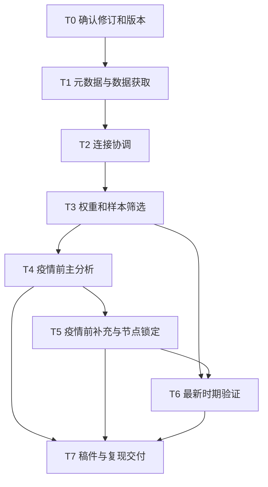

# 哮喘与类风湿关节炎：年份扩展分析方案修订案

日期：2026-10-08；版本：v1.0；阶段二修订已确认，进入阶段三。用户确认增加预先规定的跨期合并补充分析；本版在新数据及结局模型执行前锁定。

## 问题目标

将已完成研究更新至当前可用的相关NHANES公开资料，评估原横断面关联在扩展疫情前样本和最新调查时期中的表现。用户本次要求为：“现在老师希望数据用到现在，不止18年，可以帮忙修改代码重新做吗？”

推荐：1999—2020年3月为扩展主分析；2021年8月—2023年8月为独立时期验证。这里的验证是重复横断面关联分析，不是预测模型验证、临床确诊或因果验证。不得把数据范围写成1999—2026，也不声称连续覆盖疫情暂停期间。

### 阶段、正式输入及上下文隔离

研究问题和原分析已获确认，本轮是年份及实现方式修订，不另行发起机制研究。正式范围输入如下；路径均相对本仓库根目录：

| 文档 | 本轮读取时SHA256 |
|---|---|
| docs/research_ideas/2026-09-28-original-proposal-asthma-ra-idea.md | e0a27a1b625e92cd313f7b6b2003f4c17756f26dc16c2a344455780d97cc87a3 |
| docs/research_plans/2026-09-28-original-proposal-asthma-ra-experiment-plan.md | 4b208acf036e07dda20780608252f980e60a1db6bbce54546f1e37d157d6cb16 |
| docs/research_ideas/2026-09-29-asthma-ra-supplement-authorized-idea.md | b9fefe65902459a7b111157c6de5c9f94a3d01ebdf613e4fc7064b7c75fa0a39 |
| docs/research_plans/2026-09-29-asthma-ra-supplement-experiment-plan.md | 7d3ec03de6c3a4e7814470a769a3e3fbd21f92d4eb7470e6cdc3c7622d65fdf5 |

本次变更要求已写入本文；执行阶段仅以确认后的本文及表中正式引用文件为范围依据，不从聊天中提取未记录的额外决定。旧程序与结果是实现审查材料，不是研究范围来源。本文与旧方案冲突处，以确认后的本文为准。

输出文档即本文件。验证标准：时间范围明确、来源可查、参与者不重复、疾病定义保持、权重有依据、每项主张具备验证任务与失败解释；确认前不进入执行。用户在2026-10-08报告硬盘已挂载，本轮实测 `/Volumes/Elements` 为独立挂载设备，剩余约406 GiB；执行前再次检查。

## 已知量定义

NHANES为美国国家健康和营养检查调查；RA为类风湿关节炎；BMI为体质指数；PIR为贫困收入比；MEC为流动体检中心；PSU为主要抽样单位。DEMO、MCQ、SMQ、BMX分别指人口学、疾病问卷、吸烟问卷和体格测量文件。XPT是官方参与者数据格式。以下代码名称均是官方字段标识。

### 官方公开资料预核查

查阅日2026-10-08。官方入口已出现2025—2027调查，但未发现本研究所需的对应公开XPT；最新已确认具备相关四模块的周期为2021年8月—2023年8月。发布年份不等于采集年份，不能仅据搜索参数生成的网页标题判断周期。[数据入口](https://wwwn.cdc.gov/nchs/nhanes/default.aspx)

| 数据范围 | 本地与来源状态 | 测量可用性与可信度 | 下一步 | 当前不直接分析的理由 |
|---|---|---|---|---|
| 1999—2016 | 旧合规执行已有文件及清单；本轮未逐一重验 | 正式原方案已有逐周期定义，执行时重新核对 | 按下述全新获取政策处理36文件 | 尚未锁定新版范围与输入 |
| 2017—2020年3月 | 官方P_DEMO、P_MCQ、P_SMQ、P_BMX；旧2017—2018文件不能替代 | 所需疾病题、吸烟及BMI存在；特殊权重已核实 | 取得4文件及官方文档 | 必须替换原2017—2018周期，不能直接追加 |
| 2021年8月—2023年8月 | 官方DEMO_L、MCQ_L、SMQ_L、BMX_L | 所需字段存在；最新周期设计变化须记录 | 取得4文件，单独设计 | 跨疫情合并假设缺乏依据 |
| 2025—2027 | 调查入口存在，相关公开文件未确认 | 不具备本次实施资格 | 排除本轮范围 | 不能把正在开展的调查当作已公开数据 |

P文件已经包含2017—2018资料。因此扩展主分析由1999—2016九个两年周期与一个2017—2020年3月特殊周期组成；不能再加2017—2018的J文件。[官方疫情前说明](https://wwwn.cdc.gov/nchs/nhanes/continuousnhanes/default.aspx?Cycle=2017-2020)

CDC一般不建议将2021—2023与以前周期直接合并，原因包括约1.5年的调查间隔及疫情造成的健康、就医和社会条件变化。这是一般性建议，不是绝对禁止。本研究没有足以支撑合并间隔假设的资料，故建议分开估计。[权重教程](https://wwwn.cdc.gov/nchs/nhanes/tutorials/weighting.aspx)

### 定义保持与新增周期字段

| 项目 | 保持的规则 | 新周期预核查 |
|---|---|---|
| 人群 | 年龄20—79岁；不另增孕妇等排除条件 | RIDAGEYR；高龄顶码不回填为79岁 |
| 结局 | 曾被医生或其他卫生专业人员告知患哮喘 | P_MCQ和MCQ_L均保留MCQ010；1是、2否；7拒答、9不知道不能作否 |
| RA | 总关节炎题是，且类型明确为RA | MCQ160A为1且MCQ195为2；按文件实际字段大小写协调 |
| 对照 | 总关节炎题明确否 | MCQ160A为2；类型合法跳过不作疾病缺失 |
| 其他关节炎 | 其他类型、类型未知、总题未知分别记录 | 不合并到对照；MCQ195其他编码逐项核对 |
| 七项协变量 | 年龄、性别、种族族裔、教育、PIR、实测BMI、吸烟 | RIDAGEYR、RIAGENDR、RIDRETH1、DMDEDUC2、INDFMPIR、BMXBMI、SMQ020及SMQ040 |
| 吸烟 | 从未、既往、当前三类 | 新周期相关两题适用18岁及以上，覆盖目标年龄；SMQ020否时后题合法跳过 |
| BMI | 官方实测衍生BMI；成人四分类仅用于分类比较 | 新周期测量状态字段BMXSTATS；儿童分类BMDBMIC不能替代成人分组 |
| 缺失 | 原规定全部变量完整有效 | 区分拒答、不知道、未询问、合理跳题、模块未匹配、空值和冲突；不插补 |
| 分类比较 | 年龄20—39/40—59/60—79；BMI低于18.5、18.5至低于25、25至低于30、30及以上；PIR低于1/1及以上 | 主模型年龄、BMI、PIR仍连续 |

上述属于可用性预核查，不代表44份实际文件的完整资格验收。执行阶段逐文件核对题干、适用年龄、跳题、代码、频数、体检状态、特殊值、访问方式及权重版本。新增周期代码本入口：

- 疫情前：[P_DEMO](https://wwwn.cdc.gov/Nchs/Data/Nhanes/Public/2017/DataFiles/P_DEMO.htm)、[P_MCQ](https://wwwn.cdc.gov/Nchs/Data/Nhanes/Public/2017/DataFiles/P_MCQ.htm)、[P_SMQ](https://wwwn.cdc.gov/Nchs/Data/Nhanes/Public/2017/DataFiles/P_SMQ.htm)、[P_BMX](https://wwwn.cdc.gov/Nchs/Data/Nhanes/Public/2017/DataFiles/P_BMX.htm)。
- 最新：[DEMO_L](https://wwwn.cdc.gov/Nchs/Data/Nhanes/Public/2021/DataFiles/DEMO_L.htm)、[MCQ_L](https://wwwn.cdc.gov/Nchs/Data/Nhanes/Public/2021/DataFiles/MCQ_L.htm)、[SMQ_L](https://wwwn.cdc.gov/Nchs/Data/Nhanes/Public/2021/DataFiles/SMQ_L.htm)、[BMX_L](https://wwwn.cdc.gov/Nchs/Data/Nhanes/Public/2021/DataFiles/BMX_L.htm)。
- [2021—2023设计及分析说明](https://wwwn.cdc.gov/nchs/nhanes/continuousnhanes/overviewbrief.aspx?Cycle=2021-2023)：抽样设计、参与及访问方式变化可能影响可比性和亚组精度。

## 未知量定义

扩展样本与最新周期的最终人数、RA和哮喘事件数、缺失结构、设计自由度、模型收敛和关联估计均未知。官方代码本全体频数不是20—79岁完整病例人数。不能预填旧人数、旧优势比或猜测最新周期结果。最新周期的较小设计及样本可能限制亚组推断，执行后按真实诊断报告。

## 每个符号解释

下文仅使用以下数学记号：i表示某一受访者；w_i表示其最终分析权重；W4_i表示官方四年体检权重WTMEC4YR；W2_i表示官方两年体检权重WTMEC2YR；WP_i表示疫情前特殊体检权重WTMECPRP。乘号表示相乘，斜线表示相除。OR表示优势比，95%CI表示95%置信区间；P值是指定零假设下的检验量，不是结论为真的概率。模型编号M0—M3、B0—B4和任务编号T0—T7在对应表或段落中定义。

## 公式从哪里来

采用CDC合并权重的一般规则：1999—2002必须使用官方四年权重；后续按各发布块代表的时长占合并总时长的比例缩放。CDC将2017—2020年3月发布块作为3.2年处理。下述21.2年公式是将这些官方规则应用于本研究的推导，不冒称CDC直接发布了本研究专用权重。

## 一步一步推导

1. 1999—2002占4年；2003—2016为7个两年周期，占14年；最后疫情前发布块占3.2年。
2. 总时长为4＋7×2＋3.2＝21.2年。
3. 1999—2002的每条记录：w_i＝(4/21.2)×W4_i。前两周期的四年权重不能再各自除以2。
4. 2003—2016的每条记录：w_i＝(2/21.2)×W2_i。
5. 2017—2020年3月的每条记录：w_i＝(3.2/21.2)×WP_i。
6. 最新周期单独分析：w_i＝W2_i，不使用疫情前21.2年的缩放。
7. 两个分析集合分别在有效MEC权重和官方设计变量齐全的宽样本上建立设计，再取年龄、疾病和完整病例子总体；使用Taylor线性化方差。由于含实测BMI，使用体检权重，不用访谈权重或本研究未涉及的采血权重。

## 每一步为什么成立

### 1 主张、证据、对照和失败解释

| 主张 | 任务与输出 | 对照或反证检查 | 失败解释 |
|---|---|---|---|
| 新周期能按原定义形成研究人群 | T1—T3字典、来源、连接和筛选表 | 官方频数、唯一编号、未知状态、周期不重叠 | 测量不能协调则停止相关合并并修订方案 |
| 扩展样本可估计主要关联 | T4描述、四模型、亚组和交互 | 共同完整病例、抽样设计、收敛、分离、共线性及区间 | 不可估计或精度差须如实报告 |
| 原关联对有限预设处理具有稳定性 | T5函数形式、选择、时期和标准化结果 | 原线性模型、联合方差独立核验、不同方向结果 | 不一致削弱稳健性，不挑显著版本 |
| 较新时期结果可评价适用性 | T6独立周期四模型和预设补充 | 相同定义和协变量、稀疏诊断、方向大小及精度 | 宽区间是不确定；反向精确结果是反证 |
| 更新后的稿件忠实反映全部结果 | T7文稿及来源绑定 | 表格与正文数字核验、封存哈希、逐页检查 | 有数字或来源不一致则不得交付投稿稿 |

指定统计参数的实际估计为direct evidence；自报诊断对临床疾病属于proxy evidence；共同机制、未测混杂和缺失机制解释属于speculation；精确的不一致估计及敏感性变化作为counterevidence。没有随机、阳性或阴性实验对照；编码测试及独立计算是技术对照，不模拟研究结果。

### 2 主分析与混杂控制

每个分析集合独立确定一套完整病例，集合内部四模型使用同样的人：M0仅RA；M1再加年龄、性别、种族族裔；M2再加教育与PIR；M3再加BMI和吸烟。主模型连续变量线性形式保持。复杂抽样Logistic模型报告实际人数、事件数、调整变量、OR、95%CI和P值；沿用原方案明确指定的设计自由度推断，不能硬编码旧自由度153。

分别提供基本特征、RA及无关节炎组曾患哮喘比例、协变量与两病的分类比较。分类比较用设计校正方法，全部类别总体检验；不临时切点。年龄、性别亚组及交互沿用原方案，性别域移除恒定性别项。交互采用设计Wald联合检验，不根据各亚组是否显著判断差异。设计自由度、PSU及分层支持逐域记录。

官方分层及PSU按原字段核验：不得假设每层永远恰有两个PSU，也不得为“防重复”任意拼接周期与分层号而破坏官方跨早期周期的设计。最新周期建立独立设计。单PSU层及秩不足首先检查代码和域支持；不静默更换方差选项来产生结果。

### 3 已授权补充分析如何更新

疫情前扩展样本重做原补充集合：B0为M3；B1为年龄和PIR三节点限制性立方样条、BMI线性；B2再增加BMI样条；B3为B1增加调查发布块因子；B4为完整病例选择概率加权后的B1。标准化比例及差、选择概率联合估计方差和独立PSU核验继承正式补充方案。

样条节点按扩展疫情前完整病例中相应连续变量未加权第10、50、90百分位确定，使用R quantile type=7；在拟合结局模型前写入锁定文件。最新周期使用同一组节点；记录是否处于支持范围，不为显著性改节点。最新周期拟合B0、B1、B2和B4，选择模型移除恒定周期项；B3因只有一个周期不适用，明确标注，不能制造周期因子。

疫情前时期比较改为1999—2008与2009—2020年3月，报告两段时长不同；沿用周期调整下RA与时期交互的形式。最新周期单独列结果。跨疫情前后保留分时期估计，并按下文确认修订增加合并补充及时期交互；不通过两段P值比较声称差异。

年龄及性别补充分析在B1下重做。标准化预测参考各自分析集合的加权协变量分布，因此两个时期的标准化患病比例并非共同标准人口下的可比趋势，不用其差值推断疫情影响。选择分析只评价原方案指定的一种可观察选择解释，不能证明缺失随机，也不替代完整病例主结果。

### 4 最小集合、完整集合及失败处置

最小可行分析包括T0—T4和T6主分析及T7交付；完整交付还需T5及T6中上述适用补充任务。某补充模型不具备估计资格时，完整交付包括失败原因和诊断，不强行产生OR。完全分离、不可识别、收敛失败或有效设计无法支持推断时停止相应推断；宽区间保留并解释，不只因不显著而删结果。任何范围改变先修订本文，不自动删变量、删人或改变疾病定义。

### 5 数据寻找、获取与资源

为保守遵循用户此前“不复用已有数据”的明确要求，本修订案拟为新版全新获取44个XPT：1999—2016的36个、疫情前P文件4个、最新L文件4个。此前补充方案允许读取原合规批次；本轮提议的全新获取是独立批次策略，确认本文后采用。已下载并在本轮核验的文件可断点续用，不重复下载。只复用经核验的代码逻辑和软件环境，不读旧分析框架、插补对象或结果作为新模型输入。

预计原始文件合计约180—200 MB，实际大小在清单记录；外盘至少保留1 GB工作余量。原始数据、派生个体资料、模型、逐人预测及敏感性中间量均存放：`/Volumes/Elements/NHANES_asthma_ra_extension_20261008_fresh_v1`。执行前验证该路径所在设备确实是移动硬盘；断开则停，不创建同名本地挂载伪目录。保存URL、下载时间、字节数、SHA256、周期、模块、官方版本及资格检查。

Mac本地单进程R与survey即可；预计数据规模无需GPU或集群。先读取所需字段，及时释放中间对象；记录真实运行时间和峰值资源，不能把当前估计当实测。较耗时的联合方差计算逐项执行；不开展额外大规模重采样。

### 6 代码修改范围与版本

| 现有位置 | 核对发现 | 新版修改与验收 |
|---|---|---|
| scripts/original_proposal_v1/acquire.py | 固定1999—2018及按年份推字母后缀；无P权重分支 | 显式周期表、44文件清单、外盘约束、P和L URL及必需字段；禁止J与P共入主样本 |
| scripts/original_proposal_v1/catalog.py | 按下划线首段识别模块会误识别P文件 | 周期表显式记录模块、采集时间、发布块、权重、文档和数据路径 |
| scripts/original_proposal_v1/prepare.R | 固定循环、调查周期码和20年权重 | 参数化来源、21.2年权重、独立最新样本；逐次一对一连接及排除清单 |
| scripts/original_proposal_v1/analyze.R | 固定权重及路径 | 分析集合参数化；各自宽设计和域；实际自由度；四模型一致样本 |
| scripts/supplement_original_v1 | 固定旧输入、时期和周期结构 | 新节点锁定、时期更新、最新周期适用项、联合方差核验 |
| 稿件生成及核验脚本 | 原年份、路径和部分叙述绑定旧交付 | 新源表驱动全部数字、来源哈希、年份与版本一致，不降低验证标准 |

新版代码写入`scripts/year_extension_v1/`；汇总输出写入`outputs/year_extension_20261008_v01/`；执行文档写入`docs/research_runs/2026-10-08-asthma-ra-year-extension-run.md`。这些是拟建目录，本阶段只生成方案。保留原代码、原输出及冻结包；旧结果只用于来源审查及注明年份的对照，不填入新版主结果。

### 7 子任务、依赖和验收

| 任务 | 输入→输出 | 验收关口 |
|---|---|---|
| T0 确认修订和版本 | 本方案→确认版本、源文件哈希、执行记录 | 范围、年份结构、获取策略已确认 |
| T1 元数据及全新获取 | 官方代码本、周期表→44文件及来源字典 | 字段适用、真实XPT、哈希、外盘路径；失败则stop |
| T2 连接协调 | 四模块→宽分析框架和连接日志 | SEQN唯一；一对一；前后人数闭合；无重叠周期 |
| T3 权重与筛选 | 宽框架→两套设计、流程图及缺失表 | 权重规则独立计算核对；设计支持；排除原因闭合 |
| T4 疫情前主分析 | 主域→描述、四模型、亚组及诊断 | 定义保持；同样本；设计校正；精度可评估 |
| T5 疫情前补充 | 主域及疾病资格域→补充表、锁定节点 | 函数形式、选择模型、方差、时期按预设实施 |
| T6 最新时期验证 | 最新设计和锁定节点→独立结果及适用补充 | 相同定义；稀疏、收敛和自由度；全结果报告 |
| T7 稿件及复现 | 最终表与日志→中文Word/PDF及附件 | 数字逐项绑定、代码环境、来源、逐页视觉检查 |

每个关口日志必须包含checked、weak point、verdict和next move。verdict限pass、revise、stop、needs evidence；部分模型失败不得把整个科学结论标为pass。实现校验通过也不表示因果或临床验证通过。

## 一个最小例子

若保留旧2017—2018参与者，又追加包含他们的P文件，就会重复使用同一调查资料；即使最后删掉重复编号，也可能保留了错误版本的设计变量或权重。正确步骤是整体移除旧J发布块，以P的四个对应模块重建该发布块，再使用其特殊体检权重。此例仅解释处理逻辑，没有使用或生成模拟研究结果。

## 最后总结

当前关口：元数据可行性为pass；旧代码对新增周期的适用性为revise；实际文件资格、新样本与模型精度为needs evidence；用户已确认，进入执行。checked包括官方关键代码本、合并指导、原正式方案、代码入口及移动硬盘挂载；weak point是尚未取得和验证本轮44份实际文件、最新时期估计未知；next move是依本确认版本修改代码并执行。

预期交付：两分析集合的样本流程图、特征及加权比例、四模型、年龄性别亚组及森林图、适用补充结果、字典、来源清单、代码环境和复现说明；按既定期刊方向更新可编辑Word和PDF并逐页检查。标题及摘要明确两个观测时段；原冻存版本保留。

发表判断：现有结果具备尝试投稿的基础，更新年份主要改善时效性，并检验较新时期适用性；它本身不创造因果证据或保证创新性。最新结果无论阳性、阴性或不确定均如实纳入。不得沿用无依据的首次研究、不保证录用、不添加未测的中医机制。

## 确认记录与跨期合并补充（v1.0，优先于前文待执行措辞）

用户原文：“要不这样做？如果合并问题不大就合并？如果希望同时提供覆盖全部可用时期的总体关联，可以把跨期合并作为预先写明的补充分析，同时保留分时期结果和必要的时期差异检查。”本轮据此确认上述推荐路线并授权落实；与此前“修改代码重新做”的执行请求共同构成执行依据，无需再次确认同一范围。前文保留的“确认后”等时间措辞由此满足。

### 固定分析地位

疫情前扩展主分析及最新时期独立分析均完整保留。技术条件通过时增加跨期合并补充；合并结果不因为更显著而晋升为唯一主结果。不把“问题不大”写成缺失时期已经验证或两个时期等效。

### 合并估计目标及权重

合并对象为1999—2020年3月和2021年8月—2023年8月两个已观测时间集合；解释为按发布块时长加权的混合人群关联，不解释为连续1999—2023年平均关联、2023年当前关联或疫情因果影响。合并时长为4＋7×2＋3.2＋2＝23.2年。前文符号含义保持：1999—2002用w_i＝4/23.2×W4_i；2003—2016与2021—2023用w_i＝2/23.2×W2_i；2017—2020年3月用w_i＝3.2/23.2×WP_i。该缩放是本研究对观测时段混合目标的定义，不是CDC对跨疫情合并的特别认可。

### 合并模型与时期检查

同一合并完整病例集合运行原M0—M3，明确标为补充；另预设P1为M3增加11水平发布块因子，P2为P1将年龄和PIR改为前文锁定样条。记录每周期权重贡献、完整病例率、两病频数、事件数、缺失结构及协变量支持。

时期指标命名era，含prepandemic与latest两类；前者为1999—2020年3月，后者为2021—2023。在P1和P2分别加入RA与era的乘积项，检验关联在模型假设下是否随时期变化；era主效应已由发布块因子表示，不重复加入以免共线。报告交互系数、其指数变换得到的两时期OR比、95%CI及设计Wald P值；报告分时期独立模型的OR与95%CI。OR比指最新时期OR除以疫情前OR；不是两时期患病比例之比。交互模型假设其余协变量效应共同，须与分时期独立模型一起解释。

所有交互和分时期结果完整报告，不将P大于0.05视为“可以合并”的通行证。不预设没有临床依据的等效界值；若OR比区间很宽，则不能排除重要时期差异，应标不确定。无论合并技术与解释评价如何，保留其失败记录及完整分时期结果。

### 可执行关口

| 关口 | checked | weak point | verdict与next move |
|---|---|---|---|
| 测量资格 | 两病定义、适用年龄、问卷跳题、协变量可协调 | 相同题干不保证相同误分类 | 不可协调则stop合并；通过才建样本 |
| 数据与设计 | 无重叠、官方频数、实际权重、分层PSU及子总体方差 | 不覆盖未观测时期 | 错误则revise；通过才拟合补充 |
| 数值资格 | 收敛、秩、分离、稀疏、方差及区间 | 有限估计不等于精确 | 不可靠项不输出可解释OR；其余继续 |
| 时期解释 | 独立OR、交互OR比及区间、周期调整前后、缺失和支持 | 功效有限，不能验证疫情空档假设 | 差异或宽区间明确降级为needs evidence；仅条件性讨论混合关联 |
| 报告 | 原主分析、最新、合并结果全部列出 | 已发表先例不等于方法验证 | pass后更新文稿；不得按显著性删表 |

新增任务T6P：输入为通过T3资格的两时间集合及T5锁定节点；输出为合并四模型、P1/P2、时期交互与合并适用性评估。依赖T3、T5、T6；T7须等待T6P。数据来源策略仍为本计划全新44文件批次，约180—200 MB，外盘专用；无MR、新数据库或多重插补。

阶段二结束：方案路径即本文；核心结论为“分时期分析保留，合并仅作为有明确目标及诊断的预设补充”；未解决问题为新增数据及模型结果；下一阶段入口为锁定本文件哈希并写执行记录。阶段三只使用本文件和正式引用方案，所有新决定均已落文。
