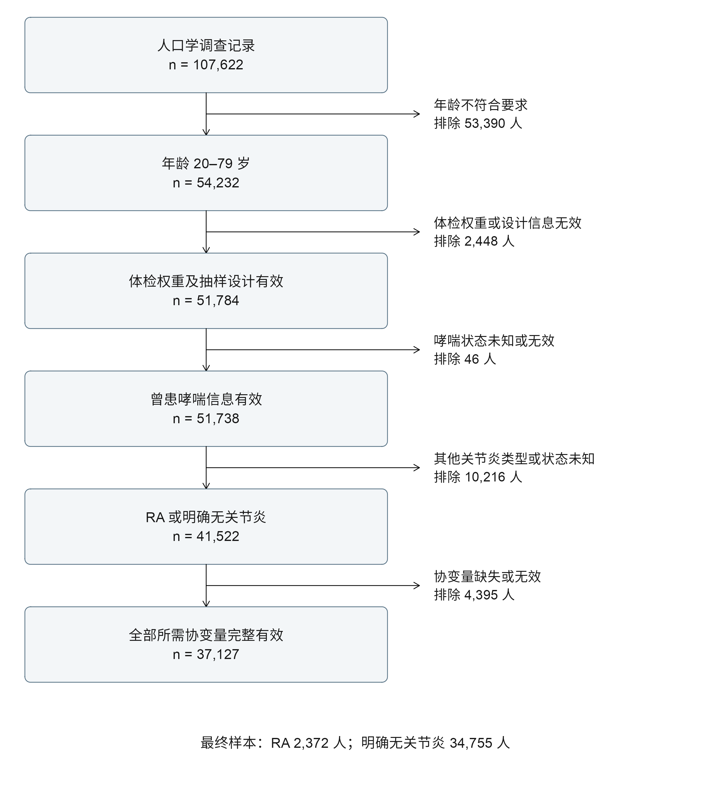
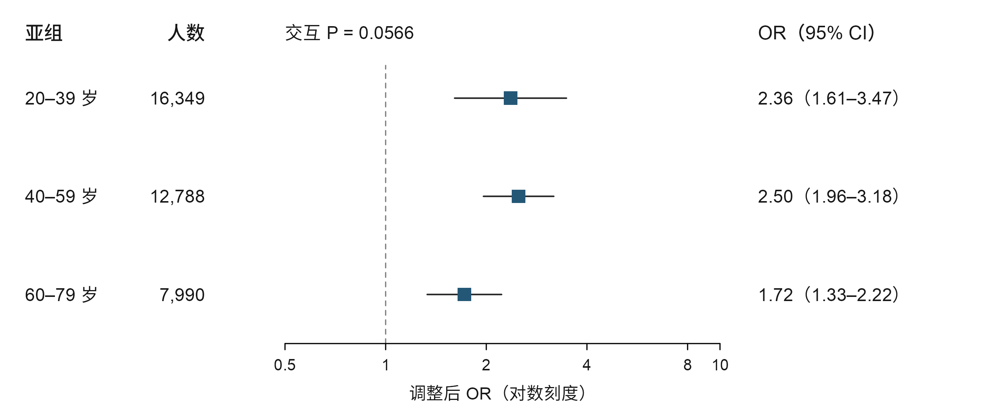
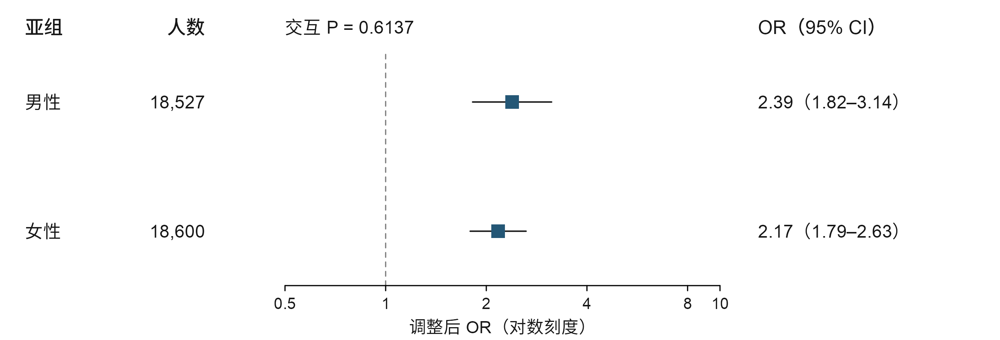
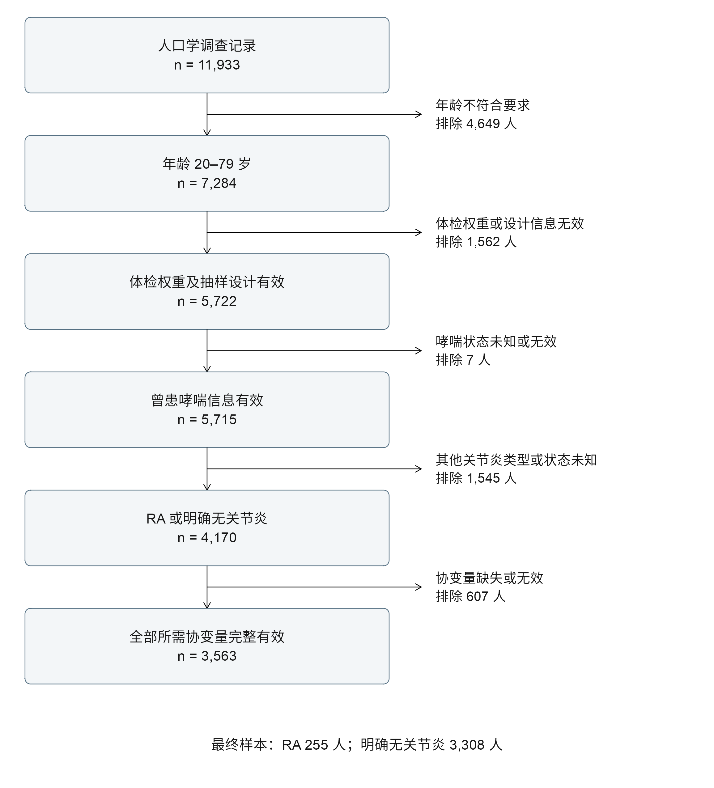
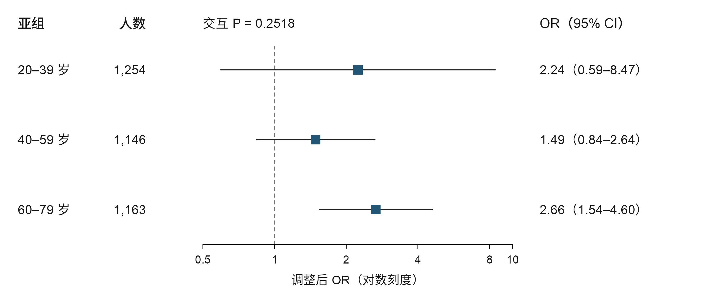
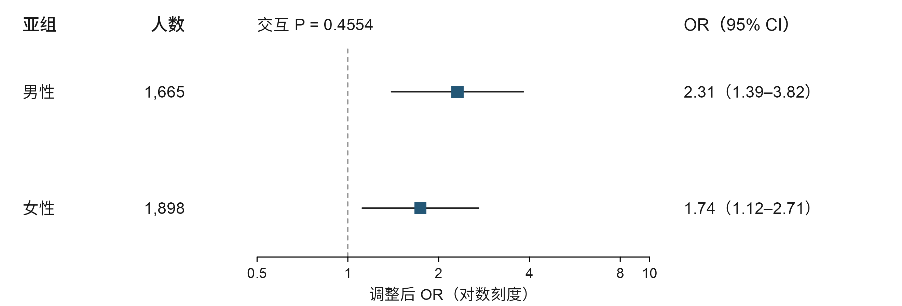

# 更新至 2023 年：结果、表格与图形

本页从已完成分析的 CSV 生成；展示值经格式化，原始精度见链接。OR 是优势比，CI 是置信区间，P 值均为双侧。比例是加权估计，人数是实际未加权人数。

## 1. 主要结果

| 分析集合 | 完整病例数 | 模型 | OR（95% CI） | P |
|---|---|---|---|---|
| 疫情前：1999—2020年3月 | 37127 | M3 | 2.27（1.91—2.70） | <0.001 |
| 最新时期：2021年8月—2023年8月 | 3563 | M3 | 1.97（1.33—2.92） | 0.002 |
| 跨期补充：已观测发布块 | 40690 | P1（另调周期） | 2.25（1.92—2.64） | <0.001 |

RA 与曾患哮喘呈正向横断面关联。跨期估计是补充结果，不能取代两个时期的独立结果。

## 疫情前：患病比例与四个主模型

| 组别 | 人数 | 哮喘人数 | 加权比例 %（95% CI） |
|---|---|---|---|
| 全部完整病例 | 37127 | 4697 | 13.23（12.72—13.76） |
| 明确无关节炎 | 34755 | 4204 | 12.77（12.27—13.29） |
| RA | 2372 | 493 | 22.23（19.63—25.07） |

| 模型 | 人数 | OR（95% CI） | P |
|---|---|---|---|
| M0 | 37127 | 1.95（1.67—2.29） | <0.001 |
| M1 | 37127 | 2.43（2.05—2.89） | <0.001 |
| M2 | 37127 | 2.39（2.02—2.84） | <0.001 |
| M3 | 37127 | 2.27（1.91—2.70） | <0.001 |

M0 未调整；M1 加年龄、性别、种族/族裔；M2 再加教育、PIR；M3 再加 BMI、吸烟。四个模型使用同一完整病例样本。

[人群特征表](../../outputs/year_extension_20261008_v01/prepandemic/characteristics.csv) · [协变量与哮喘](../../outputs/year_extension_20261008_v01/prepandemic/covariates_asthma.csv) · [协变量与RA](../../outputs/year_extension_20261008_v01/prepandemic/covariates_ra.csv) · [设计校正检验](../../outputs/year_extension_20261008_v01/prepandemic/covariate_tests.csv)

### 疫情前：样本筛选

[逐步排除人数 CSV](../../outputs/year_extension_20261008_v01/prepandemic/sample_flow.csv)

### 疫情前：亚组结果

| 亚组 | 人数 | OR（95% CI） | P |
|---|---|---|---|
| 20-39岁 | 16349 | 2.36（1.61—3.47） | <0.001 |
| 40-59岁 | 12788 | 2.50（1.96—3.18） | <0.001 |
| 60-79岁 | 7990 | 1.72（1.33—2.22） | <0.001 |
| 男 | 18527 | 2.39（1.82—3.14） | <0.001 |
| 女 | 18600 | 2.17（1.79—2.63） | <0.001 |

| 交互项 | 交互 P |
|---|---|
| RA × 年龄组 | 0.057 |
| RA × 性别 | 0.614 |

亚组间差异依据交互检验判断，不能比较各组是否显著。

### 疫情前：已完成的补充分析

| 模型 | 人数 | OR（95% CI） | P |
|---|---|---|---|
| B0 | 37127 | 2.27（1.91—2.70） | <0.001 |
| B1 | 37127 | 2.24（1.89—2.66） | <0.001 |
| B2 | 37127 | 2.23（1.88—2.66） | <0.001 |
| B3 | 37127 | 2.25（1.89—2.68） | <0.001 |
| B4 | 37127 | 2.24（1.89—2.66） | <0.001 |

B0 为 M3；B1 加入年龄/PIR 非线性；B2 再加入 BMI 非线性；B3 为 B1 加发布周期；B4 为 B1 加完整病例选择概率加权。B3 在最新单一时期不适用。

[标准化患病比例与比例差](../../outputs/year_extension_20261008_v01/prepandemic/supplement/standardized_prevalence.csv) · [补充检验](../../outputs/year_extension_20261008_v01/prepandemic/supplement/tests.csv) · [选择权重检查](../../outputs/year_extension_20261008_v01/prepandemic/supplement/selection_weight_diagnostics.csv)

## 2021—2023年：患病比例与四个主模型

| 组别 | 人数 | 哮喘人数 | 加权比例 %（95% CI） |
|---|---|---|---|
| 全部完整病例 | 3563 | 599 | 16.84（15.04—18.82） |
| 明确无关节炎 | 3308 | 532 | 16.43（14.57—18.46） |
| RA | 255 | 67 | 23.93（17.65—31.58） |

| 模型 | 人数 | OR（95% CI） | P |
|---|---|---|---|
| M0 | 3563 | 1.60（1.05—2.43） | 0.030 |
| M1 | 3563 | 2.08（1.41—3.07） | 0.001 |
| M2 | 3563 | 2.09（1.43—3.05） | <0.001 |
| M3 | 3563 | 1.97（1.33—2.92） | 0.002 |

M0 未调整；M1 加年龄、性别、种族/族裔；M2 再加教育、PIR；M3 再加 BMI、吸烟。四个模型使用同一完整病例样本。

[人群特征表](../../outputs/year_extension_20261008_v01/latest/characteristics.csv) · [协变量与哮喘](../../outputs/year_extension_20261008_v01/latest/covariates_asthma.csv) · [协变量与RA](../../outputs/year_extension_20261008_v01/latest/covariates_ra.csv) · [设计校正检验](../../outputs/year_extension_20261008_v01/latest/covariate_tests.csv)

### 2021—2023年：样本筛选

[逐步排除人数 CSV](../../outputs/year_extension_20261008_v01/latest/sample_flow.csv)

### 2021—2023年：亚组结果

| 亚组 | 人数 | OR（95% CI） | P |
|---|---|---|---|
| 20-39岁 | 1254 | 2.24（0.59—8.47） | 0.216 |
| 40-59岁 | 1146 | 1.49（0.84—2.64） | 0.161 |
| 60-79岁 | 1163 | 2.66（1.54—4.60） | 0.002 |
| 男 | 1665 | 2.31（1.39—3.82） | 0.003 |
| 女 | 1898 | 1.74（1.12—2.71） | 0.018 |

| 交互项 | 交互 P |
|---|---|
| RA × 年龄组 | 0.252 |
| RA × 性别 | 0.455 |

亚组间差异依据交互检验判断，不能比较各组是否显著。

### 2021—2023年：已完成的补充分析

| 模型 | 人数 | OR（95% CI） | P |
|---|---|---|---|
| B0 | 3563 | 1.97（1.33—2.92） | 0.002 |
| B1 | 3563 | 1.92（1.24—2.96） | 0.006 |
| B2 | 3563 | 1.92（1.24—2.95） | 0.006 |
| B4 | 3563 | 1.93（1.25—2.98） | 0.006 |

B0 为 M3；B1 加入年龄/PIR 非线性；B2 再加入 BMI 非线性；B3 为 B1 加发布周期；B4 为 B1 加完整病例选择概率加权。B3 在最新单一时期不适用。

[标准化患病比例与比例差](../../outputs/year_extension_20261008_v01/latest/supplement/standardized_prevalence.csv) · [补充检验](../../outputs/year_extension_20261008_v01/latest/supplement/tests.csv) · [选择权重检查](../../outputs/year_extension_20261008_v01/latest/supplement/selection_weight_diagnostics.csv)

## 跨期补充与时期差异

| 模型 | 估计量 | 估计值（95% CI） | P |
|---|---|---|---|
| P1 | 共同OR | 2.25（1.92—2.64） | <0.001 |
| P2 | 共同OR | 2.22（1.89—2.61） | <0.001 |
| I1 | 最新/疫情前OR之比 | 0.85（0.56—1.28） | 0.430 |
| I2 | 最新/疫情前OR之比 | 0.84（0.55—1.29） | 0.421 |

P1 为完全调整并控制发布周期；P2 再处理年龄/PIR 非线性；I1、I2 为对应时期交互模型。时期交互未提供充分差异证据，但其区间仍允许有意义的差异，不能据此宣称等效或合并无风险。

[正式跨期模型表](../../outputs/year_extension_20261008_v01/pooled/pooling_models.csv) · [时期交互检验](../../outputs/year_extension_20261008_v01/pooled/period_interactions.csv) · [各发布块权重贡献](../../outputs/year_extension_20261008_v01/pooled/cycle_contributions.csv)

`pooled/regression.csv` 是合并计算检查中的基础模型输出；正式报告使用加入周期的 `pooling_models.csv`，两者不可混用。

## 证据边界

- **Direct evidence（直接观察证据）**：上述指定定义、样本和模型下，数据表显示自报 RA 与曾患哮喘的正向关联。
- **Proxy evidence（代理证据）**：疾病来自受访者自报医生诊断，并非本研究重新实施的临床分类诊断。
- **Speculation（推测）**：共同炎症、免疫通路、药物等解释没有在本研究得到机制验证。
- **Counterevidence / uncertainty（反证与不确定性）**：现有交互检验不足以支持稳定的年龄、性别或时期差异；未测混杂、完整病例选择、自报误分和时间顺序不明仍限制解释。

## 全部汇总结果文件

以下入口同时保留阳性、阴性和不确定结果，以及诊断与验证文件。

### prepandemic

- [all_model_coefficients.csv](../../outputs/year_extension_20261008_v01/prepandemic/all_model_coefficients.csv)

- [analysis_gate.json](../../outputs/year_extension_20261008_v01/prepandemic/analysis_gate.json)

- [analysis_ranges.csv](../../outputs/year_extension_20261008_v01/prepandemic/analysis_ranges.csv)

- [asthma_prevalence.csv](../../outputs/year_extension_20261008_v01/prepandemic/asthma_prevalence.csv)

- [binned_model_residuals.csv](../../outputs/year_extension_20261008_v01/prepandemic/binned_model_residuals.csv)

- [categorical_cells.csv](../../outputs/year_extension_20261008_v01/prepandemic/categorical_cells.csv)

- [characteristics.csv](../../outputs/year_extension_20261008_v01/prepandemic/characteristics.csv)

- [collinearity.csv](../../outputs/year_extension_20261008_v01/prepandemic/collinearity.csv)

- [continuous_correlations.csv](../../outputs/year_extension_20261008_v01/prepandemic/continuous_correlations.csv)

- [continuous_quantiles.csv](../../outputs/year_extension_20261008_v01/prepandemic/continuous_quantiles.csv)

- [covariate_tests.csv](../../outputs/year_extension_20261008_v01/prepandemic/covariate_tests.csv)

- [covariates_asthma.csv](../../outputs/year_extension_20261008_v01/prepandemic/covariates_asthma.csv)

- [covariates_ra.csv](../../outputs/year_extension_20261008_v01/prepandemic/covariates_ra.csv)

- [cycle_samples.csv](../../outputs/year_extension_20261008_v01/prepandemic/cycle_samples.csv)

- [cycle_strata.csv](../../outputs/year_extension_20261008_v01/prepandemic/cycle_strata.csv)

- [design_audit.csv](../../outputs/year_extension_20261008_v01/prepandemic/design_audit.csv)

- [domain_psu_counts.csv](../../outputs/year_extension_20261008_v01/prepandemic/domain_psu_counts.csv)

- [education_raw_counts.csv](../../outputs/year_extension_20261008_v01/prepandemic/education_raw_counts.csv)

- [independent_input_validation.json](../../outputs/year_extension_20261008_v01/prepandemic/independent_input_validation.json)

- [independent_validation.csv](../../outputs/year_extension_20261008_v01/prepandemic/independent_validation.csv)

- [independent_validation.json](../../outputs/year_extension_20261008_v01/prepandemic/independent_validation.json)

- [interaction_tests.csv](../../outputs/year_extension_20261008_v01/prepandemic/interaction_tests.csv)

- [missingness.csv](../../outputs/year_extension_20261008_v01/prepandemic/missingness.csv)

- [model_design_support.csv](../../outputs/year_extension_20261008_v01/prepandemic/model_design_support.csv)

- [model_diagnostics.csv](../../outputs/year_extension_20261008_v01/prepandemic/model_diagnostics.csv)

- [model_gate.json](../../outputs/year_extension_20261008_v01/prepandemic/model_gate.json)

- [model_ra_asthma_cells.csv](../../outputs/year_extension_20261008_v01/prepandemic/model_ra_asthma_cells.csv)

- [phenotype_qc.csv](../../outputs/year_extension_20261008_v01/prepandemic/phenotype_qc.csv)

- [preparation_gate.json](../../outputs/year_extension_20261008_v01/prepandemic/preparation_gate.json)

- [regression.csv](../../outputs/year_extension_20261008_v01/prepandemic/regression.csv)

- [sample_flow.csv](../../outputs/year_extension_20261008_v01/prepandemic/sample_flow.csv)

- [separation_checks.csv](../../outputs/year_extension_20261008_v01/prepandemic/separation_checks.csv)

- [smoking_missing_reasons.csv](../../outputs/year_extension_20261008_v01/prepandemic/smoking_missing_reasons.csv)

- [source_reconstruction.csv](../../outputs/year_extension_20261008_v01/prepandemic/source_reconstruction.csv)

- [subgroups.csv](../../outputs/year_extension_20261008_v01/prepandemic/subgroups.csv)

- [supplement/all_estimates.csv](../../outputs/year_extension_20261008_v01/prepandemic/supplement/all_estimates.csv)

- [supplement/analysis_gate.json](../../outputs/year_extension_20261008_v01/prepandemic/supplement/analysis_gate.json)

- [supplement/binned_residuals.csv](../../outputs/year_extension_20261008_v01/prepandemic/supplement/binned_residuals.csv)

- [supplement/covariate_support.csv](../../outputs/year_extension_20261008_v01/prepandemic/supplement/covariate_support.csv)

- [supplement/diagnostics.csv](../../outputs/year_extension_20261008_v01/prepandemic/supplement/diagnostics.csv)

- [supplement/independent_validation.csv](../../outputs/year_extension_20261008_v01/prepandemic/supplement/independent_validation.csv)

- [supplement/independent_validation.json](../../outputs/year_extension_20261008_v01/prepandemic/supplement/independent_validation.json)

- [supplement/knots.csv](../../outputs/year_extension_20261008_v01/prepandemic/supplement/knots.csv)

- [supplement/missing_patterns.csv](../../outputs/year_extension_20261008_v01/prepandemic/supplement/missing_patterns.csv)

- [supplement/numerical_validation.csv](../../outputs/year_extension_20261008_v01/prepandemic/supplement/numerical_validation.csv)

- [supplement/older_age_basis_validation.csv](../../outputs/year_extension_20261008_v01/prepandemic/supplement/older_age_basis_validation.csv)

- [supplement/regression.csv](../../outputs/year_extension_20261008_v01/prepandemic/supplement/regression.csv)

- [supplement/selection_characteristics.csv](../../outputs/year_extension_20261008_v01/prepandemic/supplement/selection_characteristics.csv)

- [supplement/selection_rates.csv](../../outputs/year_extension_20261008_v01/prepandemic/supplement/selection_rates.csv)

- [supplement/selection_weight_diagnostics.csv](../../outputs/year_extension_20261008_v01/prepandemic/supplement/selection_weight_diagnostics.csv)

- [supplement/standardized_covariance.csv](../../outputs/year_extension_20261008_v01/prepandemic/supplement/standardized_covariance.csv)

- [supplement/standardized_prevalence.csv](../../outputs/year_extension_20261008_v01/prepandemic/supplement/standardized_prevalence.csv)

- [supplement/support_cells.csv](../../outputs/year_extension_20261008_v01/prepandemic/supplement/support_cells.csv)

- [supplement/support_overlap.csv](../../outputs/year_extension_20261008_v01/prepandemic/supplement/support_overlap.csv)

- [supplement/tests.csv](../../outputs/year_extension_20261008_v01/prepandemic/supplement/tests.csv)

### latest

- [all_model_coefficients.csv](../../outputs/year_extension_20261008_v01/latest/all_model_coefficients.csv)

- [analysis_gate.json](../../outputs/year_extension_20261008_v01/latest/analysis_gate.json)

- [analysis_ranges.csv](../../outputs/year_extension_20261008_v01/latest/analysis_ranges.csv)

- [asthma_prevalence.csv](../../outputs/year_extension_20261008_v01/latest/asthma_prevalence.csv)

- [binned_model_residuals.csv](../../outputs/year_extension_20261008_v01/latest/binned_model_residuals.csv)

- [categorical_cells.csv](../../outputs/year_extension_20261008_v01/latest/categorical_cells.csv)

- [characteristics.csv](../../outputs/year_extension_20261008_v01/latest/characteristics.csv)

- [collinearity.csv](../../outputs/year_extension_20261008_v01/latest/collinearity.csv)

- [continuous_correlations.csv](../../outputs/year_extension_20261008_v01/latest/continuous_correlations.csv)

- [continuous_quantiles.csv](../../outputs/year_extension_20261008_v01/latest/continuous_quantiles.csv)

- [covariate_tests.csv](../../outputs/year_extension_20261008_v01/latest/covariate_tests.csv)

- [covariates_asthma.csv](../../outputs/year_extension_20261008_v01/latest/covariates_asthma.csv)

- [covariates_ra.csv](../../outputs/year_extension_20261008_v01/latest/covariates_ra.csv)

- [cycle_samples.csv](../../outputs/year_extension_20261008_v01/latest/cycle_samples.csv)

- [cycle_strata.csv](../../outputs/year_extension_20261008_v01/latest/cycle_strata.csv)

- [design_audit.csv](../../outputs/year_extension_20261008_v01/latest/design_audit.csv)

- [domain_psu_counts.csv](../../outputs/year_extension_20261008_v01/latest/domain_psu_counts.csv)

- [education_raw_counts.csv](../../outputs/year_extension_20261008_v01/latest/education_raw_counts.csv)

- [independent_input_validation.json](../../outputs/year_extension_20261008_v01/latest/independent_input_validation.json)

- [independent_validation.csv](../../outputs/year_extension_20261008_v01/latest/independent_validation.csv)

- [independent_validation.json](../../outputs/year_extension_20261008_v01/latest/independent_validation.json)

- [interaction_tests.csv](../../outputs/year_extension_20261008_v01/latest/interaction_tests.csv)

- [missingness.csv](../../outputs/year_extension_20261008_v01/latest/missingness.csv)

- [model_design_support.csv](../../outputs/year_extension_20261008_v01/latest/model_design_support.csv)

- [model_diagnostics.csv](../../outputs/year_extension_20261008_v01/latest/model_diagnostics.csv)

- [model_gate.json](../../outputs/year_extension_20261008_v01/latest/model_gate.json)

- [model_ra_asthma_cells.csv](../../outputs/year_extension_20261008_v01/latest/model_ra_asthma_cells.csv)

- [phenotype_qc.csv](../../outputs/year_extension_20261008_v01/latest/phenotype_qc.csv)

- [preparation_gate.json](../../outputs/year_extension_20261008_v01/latest/preparation_gate.json)

- [regression.csv](../../outputs/year_extension_20261008_v01/latest/regression.csv)

- [sample_flow.csv](../../outputs/year_extension_20261008_v01/latest/sample_flow.csv)

- [separation_checks.csv](../../outputs/year_extension_20261008_v01/latest/separation_checks.csv)

- [smoking_missing_reasons.csv](../../outputs/year_extension_20261008_v01/latest/smoking_missing_reasons.csv)

- [source_reconstruction.csv](../../outputs/year_extension_20261008_v01/latest/source_reconstruction.csv)

- [subgroups.csv](../../outputs/year_extension_20261008_v01/latest/subgroups.csv)

- [supplement/all_estimates.csv](../../outputs/year_extension_20261008_v01/latest/supplement/all_estimates.csv)

- [supplement/analysis_gate.json](../../outputs/year_extension_20261008_v01/latest/supplement/analysis_gate.json)

- [supplement/binned_residuals.csv](../../outputs/year_extension_20261008_v01/latest/supplement/binned_residuals.csv)

- [supplement/covariate_support.csv](../../outputs/year_extension_20261008_v01/latest/supplement/covariate_support.csv)

- [supplement/diagnostics.csv](../../outputs/year_extension_20261008_v01/latest/supplement/diagnostics.csv)

- [supplement/independent_validation.csv](../../outputs/year_extension_20261008_v01/latest/supplement/independent_validation.csv)

- [supplement/independent_validation.json](../../outputs/year_extension_20261008_v01/latest/supplement/independent_validation.json)

- [supplement/knots.csv](../../outputs/year_extension_20261008_v01/latest/supplement/knots.csv)

- [supplement/missing_patterns.csv](../../outputs/year_extension_20261008_v01/latest/supplement/missing_patterns.csv)

- [supplement/numerical_validation.csv](../../outputs/year_extension_20261008_v01/latest/supplement/numerical_validation.csv)

- [supplement/older_age_basis_validation.csv](../../outputs/year_extension_20261008_v01/latest/supplement/older_age_basis_validation.csv)

- [supplement/regression.csv](../../outputs/year_extension_20261008_v01/latest/supplement/regression.csv)

- [supplement/selection_characteristics.csv](../../outputs/year_extension_20261008_v01/latest/supplement/selection_characteristics.csv)

- [supplement/selection_rates.csv](../../outputs/year_extension_20261008_v01/latest/supplement/selection_rates.csv)

- [supplement/selection_weight_diagnostics.csv](../../outputs/year_extension_20261008_v01/latest/supplement/selection_weight_diagnostics.csv)

- [supplement/standardized_covariance.csv](../../outputs/year_extension_20261008_v01/latest/supplement/standardized_covariance.csv)

- [supplement/standardized_prevalence.csv](../../outputs/year_extension_20261008_v01/latest/supplement/standardized_prevalence.csv)

- [supplement/support_cells.csv](../../outputs/year_extension_20261008_v01/latest/supplement/support_cells.csv)

- [supplement/support_overlap.csv](../../outputs/year_extension_20261008_v01/latest/supplement/support_overlap.csv)

- [supplement/tests.csv](../../outputs/year_extension_20261008_v01/latest/supplement/tests.csv)

### pooled

- [all_model_coefficients.csv](../../outputs/year_extension_20261008_v01/pooled/all_model_coefficients.csv)

- [analysis_gate.json](../../outputs/year_extension_20261008_v01/pooled/analysis_gate.json)

- [analysis_ranges.csv](../../outputs/year_extension_20261008_v01/pooled/analysis_ranges.csv)

- [asthma_prevalence.csv](../../outputs/year_extension_20261008_v01/pooled/asthma_prevalence.csv)

- [binned_model_residuals.csv](../../outputs/year_extension_20261008_v01/pooled/binned_model_residuals.csv)

- [categorical_cells.csv](../../outputs/year_extension_20261008_v01/pooled/categorical_cells.csv)

- [characteristics.csv](../../outputs/year_extension_20261008_v01/pooled/characteristics.csv)

- [collinearity.csv](../../outputs/year_extension_20261008_v01/pooled/collinearity.csv)

- [continuous_correlations.csv](../../outputs/year_extension_20261008_v01/pooled/continuous_correlations.csv)

- [continuous_quantiles.csv](../../outputs/year_extension_20261008_v01/pooled/continuous_quantiles.csv)

- [covariate_tests.csv](../../outputs/year_extension_20261008_v01/pooled/covariate_tests.csv)

- [covariates_asthma.csv](../../outputs/year_extension_20261008_v01/pooled/covariates_asthma.csv)

- [covariates_ra.csv](../../outputs/year_extension_20261008_v01/pooled/covariates_ra.csv)

- [cycle_contributions.csv](../../outputs/year_extension_20261008_v01/pooled/cycle_contributions.csv)

- [cycle_samples.csv](../../outputs/year_extension_20261008_v01/pooled/cycle_samples.csv)

- [cycle_strata.csv](../../outputs/year_extension_20261008_v01/pooled/cycle_strata.csv)

- [design_audit.csv](../../outputs/year_extension_20261008_v01/pooled/design_audit.csv)

- [domain_psu_counts.csv](../../outputs/year_extension_20261008_v01/pooled/domain_psu_counts.csv)

- [education_raw_counts.csv](../../outputs/year_extension_20261008_v01/pooled/education_raw_counts.csv)

- [independent_input_validation.json](../../outputs/year_extension_20261008_v01/pooled/independent_input_validation.json)

- [independent_validation.csv](../../outputs/year_extension_20261008_v01/pooled/independent_validation.csv)

- [independent_validation.json](../../outputs/year_extension_20261008_v01/pooled/independent_validation.json)

- [interaction_tests.csv](../../outputs/year_extension_20261008_v01/pooled/interaction_tests.csv)

- [missingness.csv](../../outputs/year_extension_20261008_v01/pooled/missingness.csv)

- [model_design_support.csv](../../outputs/year_extension_20261008_v01/pooled/model_design_support.csv)

- [model_diagnostics.csv](../../outputs/year_extension_20261008_v01/pooled/model_diagnostics.csv)

- [model_gate.json](../../outputs/year_extension_20261008_v01/pooled/model_gate.json)

- [model_ra_asthma_cells.csv](../../outputs/year_extension_20261008_v01/pooled/model_ra_asthma_cells.csv)

- [period_interactions.csv](../../outputs/year_extension_20261008_v01/pooled/period_interactions.csv)

- [phenotype_qc.csv](../../outputs/year_extension_20261008_v01/pooled/phenotype_qc.csv)

- [pooling_gate.json](../../outputs/year_extension_20261008_v01/pooled/pooling_gate.json)

- [pooling_independent_validation.csv](../../outputs/year_extension_20261008_v01/pooled/pooling_independent_validation.csv)

- [pooling_independent_validation.json](../../outputs/year_extension_20261008_v01/pooled/pooling_independent_validation.json)

- [pooling_model_diagnostics.csv](../../outputs/year_extension_20261008_v01/pooled/pooling_model_diagnostics.csv)

- [pooling_models.csv](../../outputs/year_extension_20261008_v01/pooled/pooling_models.csv)

- [preparation_gate.json](../../outputs/year_extension_20261008_v01/pooled/preparation_gate.json)

- [regression.csv](../../outputs/year_extension_20261008_v01/pooled/regression.csv)

- [sample_flow.csv](../../outputs/year_extension_20261008_v01/pooled/sample_flow.csv)

- [separation_checks.csv](../../outputs/year_extension_20261008_v01/pooled/separation_checks.csv)

- [smoking_missing_reasons.csv](../../outputs/year_extension_20261008_v01/pooled/smoking_missing_reasons.csv)

- [source_reconstruction.csv](../../outputs/year_extension_20261008_v01/pooled/source_reconstruction.csv)

- [subgroups.csv](../../outputs/year_extension_20261008_v01/pooled/subgroups.csv)
