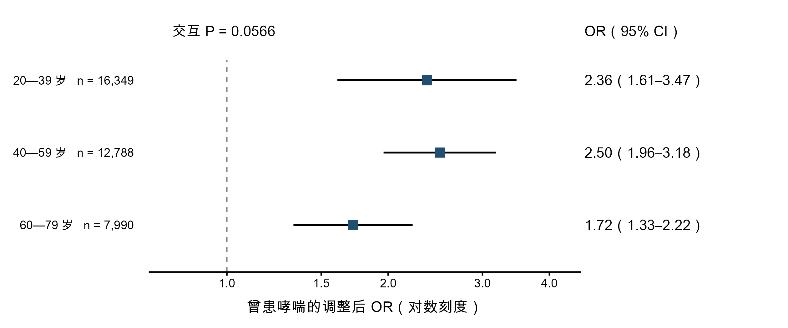
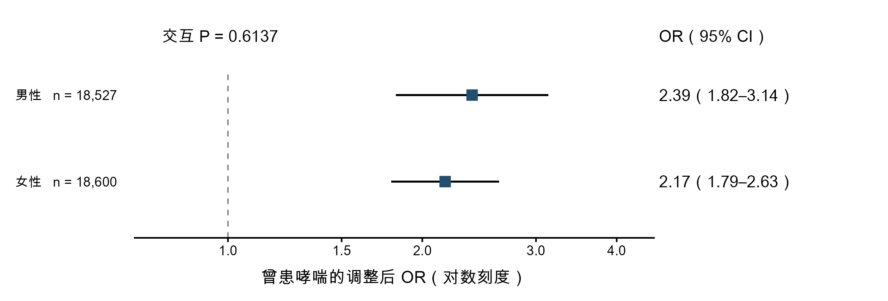

# 森林图拆分文件

按用户要求，将截图对应的疫情前（1999—2020年3月）亚组森林图拆为两个独立文件。图内不含图题或图号；保留分组、人数、调整后OR、95%置信区间及交互P值。

- 按年龄：[300 dpi PNG](age_subgroups.png) · [矢量PDF](age_subgroups.pdf)
- 按性别：[300 dpi PNG](sex_subgroups.png) · [矢量PDF](sex_subgroups.pdf)

来源为 `outputs/year_extension_20261008_v01/prepandemic/subgroups.csv` 和 `interaction_tests.csv`；副本随图保存。仅调整版面，没有重新计算模型或更改任何统计估计。原组合图、Word/PDF和已发布资料包保留。

图中比较的是各亚组内RA与明确无关节炎者的曾患哮喘优势比。交互P值检验关联强度是否因年龄或性别而不同，不是对每个亚组单独检验RA与哮喘是否有关联。年龄P=0.0566、性别P=0.6137；按双侧0.05标准，均未获得充分亚组差异证据，也不能据此证明各组完全相同。

代码：[split_subgroup_forest.R](../../scripts/review_delivery/split_subgroup_forest.R)。绘图使用已有R依赖，异机运行时可将R软件包目录作为第一个参数；脚本不下载数据。
