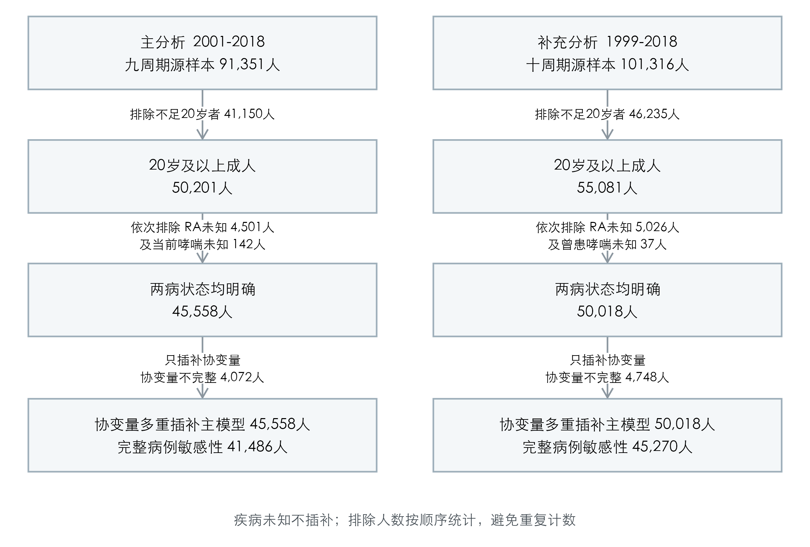
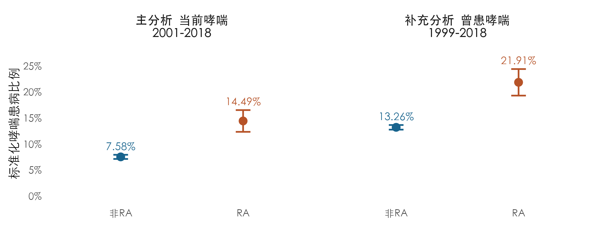
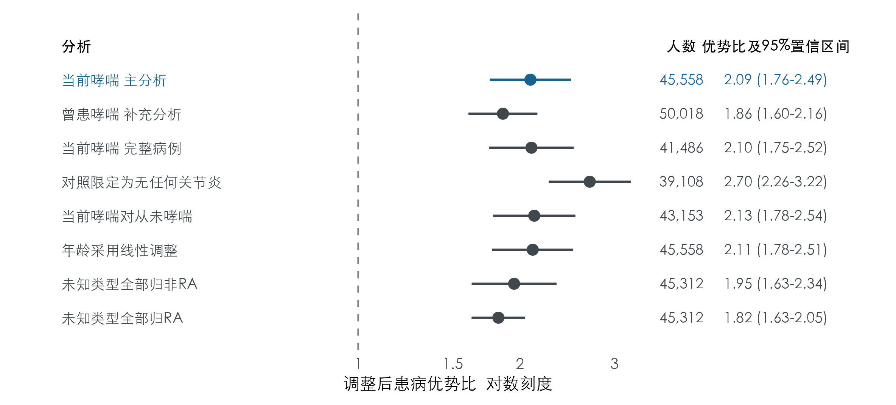

# NHANES成人哮喘与类风湿关节炎共存研究报告

导师评阅版  |  分析版本 v0.3  |  报告日期 2026年9月24日

## 摘要

目的  评估美国成人中自报医生诊断类风湿关节炎与当前哮喘的共存关联，并检查疾病定义、协变量缺失和调查周期对估计的影响。

方法  合并美国国家健康与营养调查（NHANES）数据开展横断面分析。主分析使用2001-2018年九周期、20岁及以上成人；1999-2018年曾患哮喘诊断史为补充结局。保留调查权重、分层及主要抽样单位，采用加权逻辑回归。对教育、收入和吸烟缺失进行30套多重插补，疾病状态不插补。

结果  主分析纳入45,558人，其中378人同时报告两病。完整调整后，当前哮喘患病优势比为2.09 (1.76-2.49)。标准化患病比例为类风湿关节炎组14.49%、非类风湿关节炎组7.58%，差6.90个百分点（95%置信区间4.83-8.97）。曾患哮喘补充分析纳入50,018人，优势比为1.86 (1.60-2.16)。完整病例及逐一删除周期检查方向一致。

结论  在预设定义和调整条件下，自报类风湿关节炎与当前哮喘呈正向患病关联。结果不确定发病先后，不支持因果或机制主张；疾病自报、未知关节炎类型的排除及未测混杂仍限制解释。

## 研究背景与问题

Baljet等使用NHANES研究18种共病与哮喘加重，正文采用3图4表组织人群分布、回归和分层结果[1]。另一项韩国全国调查已报道类风湿关节炎与哮喘的关联[2]。因此，本研究不将“两病可能相关”包装为首次发现，而聚焦美国调查人群中的可测量共存、跨周期协调及预设稳健性检查。

本报告参考上述文章的图表规模，实际内容对应本项目已完成的分析。年龄分层、18种共病网络、哮喘发作和急诊分析未开展，不作为本报告结果。

## 研究方法

### 研究设计与数据来源

使用NHANES公开人口学、疾病问卷和吸烟问卷，按受访者编号连接十个两年周期。共核对30份数据文件，覆盖101,316名源受访者；766项官方边际频数检查一致，连接没有增加人数。原始及个体级派生数据保存在移动硬盘，仓库仅保存代码与汇总产物。研究为多周期横断面观察性分析，不是随访队列。

### 研究人群与疾病定义

纳入20岁及以上且相应疾病状态明确者。类风湿关节炎（RA）定义为自报医生告知有关节炎且类型明确为RA；其他明确类型及无关节炎者进入非RA组，类型不明者保留未知。1999-2008年类型题RA编码为1，2009-2010年新题仍为1，2011-2018年改为2，按逐周期题目标签协调。

当前哮喘要求曾被告知哮喘且报告仍有哮喘；明确从未患哮喘者的合理跳题可归为非当前哮喘。1999-2000年成人未被询问“是否仍患哮喘”，故主分析限定2001-2018年；补充分析使用1999-2018年的曾患哮喘诊断史[3]。

### 复杂抽样与协变量

主分析使用两年访谈权重除以9；十周期补充分析中，1999-2002年使用官方四年访谈权重乘0.2，后续周期使用两年访谈权重乘0.1[4]。在完整周期源样本建立设计，再取成人分析域，保留官方分层及主要抽样单位，以Taylor线性化估计方差[5]。

M0模型仅含RA；M1加入年龄、性别、族裔和周期；M2再加入教育、收入贫困比及吸烟，为唯一预设主模型。年龄统一80岁封顶，采用3自由度自然样条，内部结点36岁和53岁。教育为五类，吸烟为从未、既往和当前三类。未纳入体重指数、用药及医疗可及性扩展。

### 缺失处理与统计推断

主分析协变量完整率91.06%，低于预设95%门槛，故对教育、收入和吸烟进行预测均值匹配插补；30套、10次迭代，随机种子20260923。插补模型包含疾病、人口学、社会经济、吸烟及调查设计信息，疾病状态不补。各套模型用Rubin规则合并，采用调查残余自由度的有限样本修正。

报告患病优势比（OR）及95%置信区间（CI），并估计共同协变量分布下的标准化患病比例及差值。敏感性包括完整病例、对照/哮喘定义、周期、年龄形式和未知类型极端归类。分析策略在关联估计前锁定；不按显著性挑选结果。

## 研究结果

### 纳入人群与分析分支

**图1 主分析与补充分析的纳入流程**

图注  RA为类风湿关节炎。疾病排除按顺序计算：先排除RA状态未知，再从剩余受访者中排除哮喘状态未知。两种疾病均未知者只计一次。主分析与补充分析人群大量重叠，属于同一数据体系中的不同结局定义，不能作为相互独立的验证队列。

主分析从50,201名成人中纳入45,558人。RA状态未知者4,501人，其中4,393人关节炎类型不明；其加权平均年龄为58.9岁，而RA状态明确者为46.1岁。排除未知者并非显然随机，必须考虑对人群构成和推广性的影响。

两病状态均明确者中，RA组2,576人，非RA组42,982人。仅协变量不完整者仍可进入多重插补主模型；完整病例敏感性使用41,486人。补充分析对应50,018人，完整病例为45,270人。

## 人群特征

**表1 主分析人群按RA状态分组的特征**

| 特征 | 非RA 42,982人 | RA 2,576人 |
| --- | --- | --- |
| 年龄 岁 | 45.6 (45.2-45.9) | 57.6 (56.9-58.3) |
| 女性 % | 51.3 (50.8-51.8) | 59.1 (56.4-61.8) |
| 族裔 墨西哥裔 % | 8.6 (7.6-9.8) | 6.6 (5.3-8.2) |
| 族裔 其他西班牙裔 % | 5.5 (4.8-6.4) | 5.1 (4.0-6.5) |
| 族裔 非西班牙裔白人 % | 67.3 (65.1-69.5) | 65.6 (62.1-69.0) |
| 族裔 非西班牙裔黑人 % | 11.0 (9.9-12.2) | 17.2 (14.9-19.7) |
| 族裔 其他或多族裔 % | 7.5 (6.9-8.2) | 5.5 (4.2-7.1) |
| 教育 低于9年级 % | 5.3 (4.9-5.7) | 9.7 (8.4-11.2) |
| 教育 9至11年级等未毕业 % | 10.4 (9.8-11.1) | 15.5 (13.8-17.5) |
| 教育 高中毕业或同等学历 % | 23.4 (22.7-24.2) | 27.3 (24.7-30.1) |
| 教育 部分大学或副学士 % | 31.2 (30.4-32.0) | 32.9 (30.2-35.7) |
| 教育 大学毕业及以上 % | 29.6 (28.2-31.1) | 14.5 (12.5-16.8) |
| 吸烟 从未 % | 55.5 (54.5-56.5) | 41.8 (38.8-44.9) |
| 吸烟 既往 % | 23.5 (22.8-24.3) | 31.8 (29.2-34.6) |
| 吸烟 当前 % | 21.0 (20.3-21.8) | 26.4 (24.0-29.0) |
| 收入贫困比 | 3.03 (2.98-3.09) | 2.49 (2.38-2.60) |
| 教育缺失 人 | 64 | 6 |
| 收入贫困比缺失 人 | 3,781 | 229 |
| 吸烟缺失 人 | 38 | 4 |

表注  年龄和收入贫困比为加权均值，其余非缺失类别为加权百分比；括号为95%置信区间。年龄按80岁封顶。各字段使用该字段有观测值的人作为分母；缺失行是未加权实际人数。描述表取插补前数据，与插补后回归模型分开。未计算特征组间检验，协变量未按特征表显著性筛选。

RA组平均年龄更高，女性及当前吸烟比例更高，大学毕业及以上比例更低，平均收入贫困比也更低。这些差异提示直接比较两组患病比例可能受到已观测人群差异影响，因此需要预设协变量调整。

## 共存分布与患病比例

**表2 两种哮喘定义下的两病联合分布**

| 分析 | 疾病组合 | 实际人数 | 加权占比 %及95%CI |
| --- | --- | --- | --- |
| 当前哮喘 | 非RA / 无当前哮喘 | 39,847 | 88.49 (87.97-88.99) |
| 当前哮喘 | 非RA / 有当前哮喘 | 3,135 | 7.23 (6.85-7.63) |
| 当前哮喘 | RA / 无当前哮喘 | 2,198 | 3.61 (3.38-3.86) |
| 当前哮喘 | RA / 有当前哮喘 | 378 | 0.67 (0.57-0.78) |
| 曾患哮喘 | 非RA / 无曾患哮喘 | 41,167 | 82.84 (82.31-83.35) |
| 曾患哮喘 | 非RA / 有曾患哮喘 | 5,901 | 12.70 (12.28-13.14) |
| 曾患哮喘 | RA / 无曾患哮喘 | 2,377 | 3.53 (3.30-3.76) |
| 曾患哮喘 | RA / 有曾患哮喘 | 573 | 0.93 (0.81-1.07) |

表注  当前哮喘各行占比以主分析45,558人的分析域为分母；曾患哮喘以补充分析50,018人的分析域为分母。每个分析分支的四行加权占比合计100%。这些占比不是RA组或非RA组内部的哮喘比例。“无当前哮喘”包括既往但现在无哮喘者。

**图2 RA与非RA组的标准化哮喘患病比例**

图注  点为M2模型的标准化患病比例，竖线为95%CI；分别标准化至各分析域的共同协变量分布，并合并30套插补。当前哮喘两组差6.90个百分点（4.83-8.97），曾患哮喘差8.65个百分点（6.18-11.12）。差值使用未四舍五入估计及组间协方差计算，不能直接用两个区间端点相减。

## 整体回归结果

**表3 主分析与补充分析的逐步调整结果**

| 分析 | 模型 | 人数 | OR及95%CI |
| --- | --- | --- | --- |
| 当前哮喘 2001-2018 | M0 | 45,558 | 2.26 (1.91-2.68) |
| 当前哮喘 2001-2018 | M1 | 45,558 | 2.30 (1.92-2.75) |
| 当前哮喘 2001-2018 | M2 | 45,558 | 2.09 (1.76-2.49) |
| 曾患哮喘 1999-2018 | M0 | 50,018 | 1.72 (1.49-1.99) |
| 曾患哮喘 1999-2018 | M1 | 50,018 | 1.96 (1.69-2.28) |
| 曾患哮喘 1999-2018 | M2 | 50,018 | 1.86 (1.60-2.16) |

表注  M0仅含RA；M1加入年龄、性别、族裔和周期；M2再加入教育、收入贫困比和吸烟。每个分支的三个模型使用相同分析域。OR是患病优势比，不是发病风险比，也不能解释为概率增加同样倍数。

**图3 主结果与主要敏感性分析的关联估计**

图注  所有行均为M2调整模型；横线为95%CI，竖虚线为OR等于1，蓝色为预设主结果。除完整病例和两个未知类型归类情景外，使用多重插补。未知类型情景应与完整病例主分析比较。常规非RA对照包含其他明确类型关节炎；“无任何关节炎”行改变了对照人群。曾患哮喘行是补充结局，不能与其他行直接等同。

主分析OR从未调整的2.26变为完整调整后的2.09，仍呈正向关联。更换为无任何关节炎对照后估计增大至2.70，表明关联大小依赖比较人群；不能仅据此解释为RA特有机制。

## 敏感性分析

**表4 疾病定义 缺失处理与调查周期敏感性结果**

| 分析情景 | 人数 | OR及95%CI |
| --- | --- | --- |
| 完整病例 当前哮喘 | 41,486 | 2.10 (1.75-2.52) |
| 对照限定为无任何关节炎 | 39,108 | 2.70 (2.26-3.22) |
| 当前哮喘对从未哮喘 | 43,153 | 2.13 (1.78-2.54) |
| 曾患哮喘 同期2001-2018 | 45,668 | 1.86 (1.59-2.18) |
| 限制为2003-2018 | 40,678 | 2.13 (1.77-2.55) |
| 年龄采用线性调整 | 45,558 | 2.11 (1.78-2.51) |
| 删除2001-2002周期 | 40,678 | 2.13 (1.77-2.55) |
| 删除2003-2004周期 | 41,026 | 2.08 (1.73-2.51) |
| 删除2005-2006周期 | 41,068 | 2.08 (1.73-2.51) |
| 删除2007-2008周期 | 40,315 | 2.09 (1.73-2.52) |
| 删除2009-2010周期 | 39,987 | 2.10 (1.74-2.53) |
| 删除2011-2012周期 | 40,440 | 2.06 (1.71-2.48) |
| 删除2013-2014周期 | 40,220 | 2.04 (1.69-2.47) |
| 删除2015-2016周期 | 40,262 | 2.09 (1.75-2.49) |
| 删除2017-2018周期 | 40,468 | 2.17 (1.82-2.60) |
| 未知关节炎类型全部归非RA | 45,312 | 1.95 (1.63-2.34) |
| 未知关节炎类型全部归RA | 45,312 | 1.82 (1.63-2.05) |
| 完整病例 曾患哮喘1999-2018 | 45,270 | 1.88 (1.61-2.19) |

表注  所有结果均完整调整。删除2001-2002周期与限制为2003-2018是同一数据限制，故数值相同，不是两次独立验证。未知类型两行使用完整病例框架，应与当前哮喘完整病例结果2.10比较；两种归类仅为情景检查，不是真实诊断，也不是全部误分类影响的严格上下界。

完整病例结果2.10与多重插补主结果2.09接近。逐一删除周期后OR为2.04-2.17，未发现单个周期决定关联方向。未知类型归类得到1.95和1.82，相比完整病例主结果有所减弱；方向一致不能排除其他缺失机制或诊断误分类。

## 讨论

### 主要发现与解释

本研究在美国成人调查样本中观察到自报RA与当前哮喘的正向共存关联。按共同协变量分布标准化后，哮喘患病比例分别为14.49%和7.58%，差约6.90个百分点，提供了比相对指标更直观的绝对尺度。结果是在所用模型和抽样假设下的统计关联，不等于疾病的生物学作用大小。

完整病例、年龄建模及周期检查的结果接近，说明关联对已检查的若干实施选择不敏感。另一方面，改变对照定义或重新归类未知关节炎类型会改变估计值。这提示论文不能只强调“稳健”，还应说明稳健性针对哪些具体选择、哪些测量与选择问题仍未解决。

### 与参考研究的关系

Baljet等研究的是当前哮喘患者中，共病与过去一年加重的关联[1]；本研究比较成人中RA与非RA者的哮喘患病情况，研究人群和结局不同，其加重相关估计不能与本研究OR直接比较。韩国全国调查也已报道两病关联[2]，故目前更合适的定位是不同调查人群中的复核及定义、缺失和周期影响评估。是否形成发表增量仍需更完整的文献比对。

### 局限与替代解释

第一，RA和哮喘均依赖自报医生诊断，没有采用专科诊断标准重新确认。其他关节炎误报为RA、呼吸疾病诊断混淆以及不同就医频率，均可能影响关联；本数据尚不能区分这些解释。

第二，RA未知者被排除且年龄偏大，可能引入选择偏倚。协变量多重插补依赖给定已观测信息后的条件随机缺失假设；收入的非随机漏报不能靠链轨迹稳定来排除。调查权重校正抽样及相关响应机制，不会自动修复疾病题目的项目缺失[4]。

第三，虽然已调整年龄、性别、族裔、周期、教育、收入和吸烟，体重指数、医疗可及性、用药及其他共病仍可能造成残余混杂。横断面资料不能确定发病先后，存活和诊断过程也可能影响被观察到的共存。

第四，主分析与补充分析人群重叠，不能视为独立验证；逐一删除周期检查的稳定，也不等于证明各周期或各年龄组的关联完全相同。本研究没有完成年龄交互作用检验。

## 结论与证据边界

在2001-2018年NHANES成人分析域中，自报RA与当前哮喘呈正向患病关联，完整调整OR为2.09（95%CI 1.76-2.49）。曾患哮喘补充分析及预设敏感性检查提供方向一致的支持，但不能消除测量误差、选择偏倚和未测混杂。

直接证据（direct evidence）是本次问卷数据中的加权关联及敏感性结果。代理证据（proxy evidence）是以自报医生诊断测量临床疾病。共同免疫机制、RA导致哮喘及用药导致变化属于尚未验证的推测（speculation）。反证与限制（counterevidence）包括1999年成人当前哮喘未被询问，否定了十周期当前哮喘直接合并的原设想；对照和未知类型处理改变估计大小，也限制了疾病特异性解释。

发作和急诊分支因新增价值条件尚未满足而未启动，不是得到阴性结果。本轮适合向导师汇报已验证的共存结果及证据缺口，尚不能宣称临床机制成立、首次发现或已经达到投稿条件。

### 复现与审核

本报告仅从正式汇总CSV生成3张图和4张表，不新增模型。正式插补对象通过范围、类别、轨迹和事件审核，主模型在新R进程回放最大数值差约7.11×10^-14；隔离项目目录恢复后再次回放一致，但复用了部分系统包和既有插补对象，完整干净环境从原始数据到插补及全部模型的复现仍未完成。

数据分析使用R 4.5.1、survey 4.5及mice 3.19.0。代码、模型表、预设计划、频数核对和运行日志见项目仓库 https://github.com/stian-liza/nhanes-asthma-ra 。报告生成入口为scripts/build_manuscript.py，图形入口为R/report_figures.R。

### 参考文献与数据来源

[1] Baljet E, Luijks H, van den Bemt L, Schermer TR. Chronic comorbid conditions and asthma exacerbation occurrence in a general population sample. npj Primary Care Respiratory Medicine. 2023;33:29. https://doi.org/10.1038/s41533-023-00350-x

[2] Kim JG, Kang J, Lee JH, Koo HK. Association of rheumatoid arthritis with bronchial asthma and asthma-related comorbidities: A population-based national surveillance study. Frontiers in Medicine. 2023;10:1006290. https://doi.org/10.3389/fmed.2023.1006290

[3] CDC NCHS. NHANES 1999-2000 Medical Conditions questionnaire and documentation. 原始问卷及逐周期变量字典用于疾病资格和编码核对。https://wwwn.cdc.gov/nchs/data/nhanes/public/1999/questionnaires/spq-mc.pdf

[4] CDC NCHS. NHANES Tutorials: Weighting. https://wwwn.cdc.gov/nchs/nhanes/tutorials/weighting.aspx

[5] CDC NCHS. NHANES Tutorials: Variance Estimation. https://wwwn.cdc.gov/nchs/nhanes/tutorials/varianceestimation.aspx
