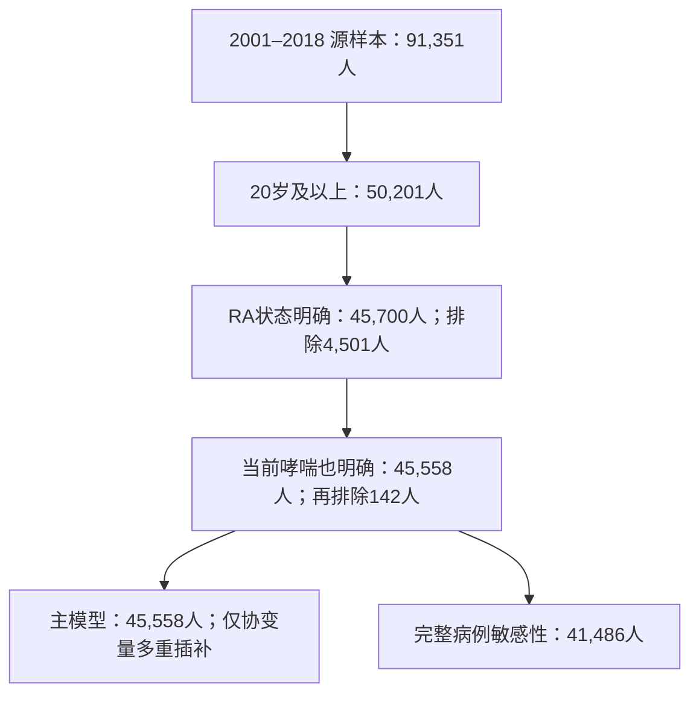

# NHANES 哮喘与类风湿关节炎：v0.3 研究结果

## 问题目标

在2001–2018年、20岁及以上的美国非机构化平民成人中，自报医生诊断类风湿关节炎（英文缩写RA）者，是否更常报告当前哮喘？这是横断面患病关联研究。补充分析使用1999–2018年的曾患哮喘诊断史。

**预设主结果：调整后的患病优势比为 2.09（95%置信区间 1.76–2.49）。** 在预设定义及调整条件下，本次分析支持自报RA与当前哮喘之间存在正向患病关联。不能据此推断因果或未来发病风险。

## 已知量定义

类风湿关节炎定义为自报曾被医生告知有关节炎且类型为类风湿关节炎；类型不明不归为阴性。当前哮喘定义为曾被告知哮喘且报告仍有哮喘。未患过哮喘者的合理跳题可判定非当前哮喘。1999–2000成人未询问是否仍患哮喘，故不用于主分析。

十周期源样本101,316人。主分析九周期源样本91,351人，成人50,201人，疾病状态共同明确45,558人，协变量完整41,486人（91.06%）。共同明确者中，RA且当前哮喘378人、RA非当前哮喘2,198人、非RA当前哮喘3,135人、非RA非当前哮喘39,847人。

原始文件30份、150.65 MB；766项官方边际频数全部一致，连接不增加人数。数字为实际记录和汇总结果，未使用模拟数据替代。模型前策略已在Git提交`d217bfd`锁定。

主分析纳入流程如下；排除按顺序计数，避免重复计算两种疾病均缺失的人。

## 未知量定义

我们估计的是该时期、该调查表型下的患病关联及其不确定性。真实专科确诊、发病先后、疾病活动度、未测混杂和收入非随机漏报的影响仍未知。RA状态不明的4,501名成人未进入主模型，其中4,393人为关节炎类型不明；其加权平均年龄58.9岁，状态明确者46.1岁，提示排除可能改变样本组成。

## 每个符号解释

- RA：类风湿关节炎的英文缩写，本研究特指自报医生诊断及类型。
- OR：患病优势比，比较患病相对于未患病的“优势”，不是患病比例比。
- 95%置信区间：模型和抽样假设下估计的不确定性区间。
- MI：多重插补；本研究仅补协变量，不补疾病状态。
- CC：完整病例，只保留所需协变量完整的人。
- M0、M1、M2：分别为未调整、基础人口学调整、完整预设协变量调整模型；M2为唯一主模型。
- p：一组的患病比例；odds：该组患病比例除以未患病比例。

## 公式从哪里来

odds = p / (1 − p)，因为人群可分为患病和未患病两部分。两组odds相除得到未调整OR。调整OR来自调查加权逻辑回归中RA系数的指数变换。

主分析九个等长周期，每个周期使用两年访谈权重除以9。全十周期曾患哮喘补充分析中，1999–2002使用官方四年权重乘0.2，其余使用两年权重乘0.1。[CDC官方权重说明](https://wwwn.cdc.gov/nchs/nhanes/tutorials/weighting.aspx)。方差保留官方分层和抽样单位，在完整源样本建立设计后取成人分析域。

## 一步一步推导

1. 按官方问卷协调病例定义、取值、跳题和年龄资格，检查原始频数与连接人数。
2. 保留疾病可明确的人群；病例状态未知仍为未知。主域协变量完整率不足预设95%，所以启动30套协变量插补，10次迭代；并保留完整病例敏感性。
3. 各套数据分别拟合调查模型，用Rubin规则合并估计和方差。主域设计自由度139，模型推断使用残余设计自由度；不把几万名受访者当几万个独立抽样单位。
4. 年龄协调为80岁封顶，3自由度自然样条内部结点为36和53岁；调整性别、族裔、周期、教育、收入贫困比、吸烟。结点和模型在拟合前确定。
5. 未调整加权哮喘比例：RA组15.59%，非RA组7.55%。它们是患病比例，不能当调整后效果。
6. 主模型OR为2.09（95%置信区间 1.76–2.49）。标准化哮喘比例：RA组14.49%（12.39–16.58%），非RA组7.58%（7.18–7.98%）；差6.90个百分点（4.83–8.97）。这是共同协变量分布下的关联描述，不是治疗或干预效果。
7. 完整病例主模型OR为2.10（95%置信区间 1.75–2.52）；1999–2018曾患哮喘补充模型OR为1.86（95%置信区间 1.60–2.16）。两种哮喘结局需分别命名。

## 每一步为什么成立

病例定义来自逐周期官方问卷；实际记录与官方频数一致。抽样权重用于校正调查抽样及相关响应机制，分层和抽样单位用于估计方差。年龄等变量按事先选择调整，以减少已观测差异，但不代表所有混杂已消除。疾病状态不明者被排除，因此对总体的推广依赖额外的完整性假设；抽样权重没有自动修复这类项目缺失。

插补预测模型包含疾病类别、人口学、周期、官方设计层、抽样单位和对数权重；收入匹配观测供体，分类字段保持实际类别。其有效性依赖条件随机缺失工作假设；链稳定不证明该假设正确。链均值稳定诊断最大值1.017（仅辅助诊断），主模型蒙特卡洛误差相对总标准误为0.004。详见轨迹与事件审核。

下表完整报告主分析和当前哮喘敏感性。未知类型的两个极端归类采用CC，应与primary_CC比较；不能把它们视为真实病例归类或严格数学界限。删除周期各自重新构造权重。

| 分析标识 | 人数 | 调整OR及95%置信区间 |
|---|---:|---|
| primary_MI | 45,558 | 2.09（95%置信区间 1.76–2.49） |
| primary_CC | 41,486 | 2.10（95%置信区间 1.75–2.52） |
| no_arthritis_MI | 39,108 | 2.70（95%置信区间 2.26–3.22） |
| current_never_MI | 43,153 | 2.13（95%置信区间 1.78–2.54） |
| from2003_MI | 40,678 | 2.13（95%置信区间 1.77–2.55） |
| linear_age_MI | 45,558 | 2.11（95%置信区间 1.78–2.51） |
| omit_2001_MI | 40,678 | 2.13（95%置信区间 1.77–2.55） |
| omit_2003_MI | 41,026 | 2.08（95%置信区间 1.73–2.51） |
| omit_2005_MI | 41,068 | 2.08（95%置信区间 1.73–2.51） |
| omit_2007_MI | 40,315 | 2.09（95%置信区间 1.73–2.52） |
| omit_2009_MI | 39,987 | 2.10（95%置信区间 1.74–2.53） |
| omit_2011_MI | 40,440 | 2.06（95%置信区间 1.71–2.48） |
| omit_2013_MI | 40,220 | 2.04（95%置信区间 1.69–2.47） |
| omit_2015_MI | 40,262 | 2.09（95%置信区间 1.75–2.49） |
| omit_2017_MI | 40,468 | 2.17（95%置信区间 1.82–2.60） |
| unknown_type_as_nonRA_CC | 45,312 | 1.95（95%置信区间 1.63–2.34） |
| unknown_type_as_RA_CC | 45,312 | 1.82（95%置信区间 1.63–2.05） |

分析标识：primary_MI为主结果；primary_CC为完整病例；no_arthritis以无关节炎者为对照；current_never排除既往非当前哮喘；from2003从2003年开始；linear_age使用线性年龄；omit为删除对应起始年份的两年周期；unknown_type为关节炎类型不明的极端归类。相同周期曾患哮喘结果另见完整模型表。

结果解释：逐一删除周期后，主关联OR约为2.04–2.17，未发现单个周期决定方向。更换为无关节炎对照后OR升至2.70，说明比较人群会影响关联大小；不能据此证明RA特有机制。类型不明两种极端归类得到OR约1.95和1.82，相比完整病例主结果2.10有所减弱，方向仍为正；这不能消除自报误分类或选择偏倚。

## 一个最小例子

以下仅为解释OR的教学例子，并非本研究结果：若两组患病比例分别为20%和10%，则odds分别为0.20/0.80=0.25、0.10/0.90≈0.111，两者相除得OR≈2.25。但患病比例之比是2，比例差是10个百分点。因此不能把本研究OR直接改写成患病概率增加同样倍数。

## 最后总结

在预设定义及调整条件下，本次分析支持自报RA与当前哮喘之间存在正向患病关联。目前支持范围限于美国调查人群中的自报患病关联。相同疾病关系已有其他人群研究，RA与哮喘加重也已有NHANES先例；本项目不能宣称首次发现或机制证实。

- direct evidence：本项目实际调查加权估计、置信区间和敏感性结果。
- proxy evidence：自报诊断及关节炎类型作为临床疾病的替代测量。
- speculation：共同免疫机制、RA导致哮喘、用药造成加重；本研究未验证。
- counterevidence/限制：1999成人当前哮喘未询问，否定原十周期当前哮喘方案的可测量性；疾病类型不明的排除和极端归类检验会限制结论强度。横断面资料不能确定方向。

发作/急诊未开展，因新增价值gate未通过；不是分析后得到阴性。BMI、医疗可及性和用药扩展也未开展，不将其称为已控制混杂。未进行干预实验或独立临床验证。

产物：[完整模型表](../results/tables/association_models.csv)、[标准化比例](../results/tables/standardized_prevalence.csv)、[人群特征](../results/tables/characteristics.csv)、[主要关联图](../results/figures/key_associations.png)、[删周期图](../results/figures/leave_one_cycle_out.png)、[复现说明](../docs/reproduce.md)。

技术复核：在独立R进程从保存的30套插补对象回放主模型，数值与主表吻合；这不是另一台机器从零获取和插补的独立复现。科学结论仍需老师审阅与更充分的文献/测量有效性论证，不因代码运行成功而自动达到投稿条件。

另外在新临时项目目录恢复依赖，重新安装12个包并复用64个匹配的系统包；76个版本全部核对一致，合成已知答案测试和主模型回放通过。仍复用了既有插补对象，因此完整干净环境端到端验收尚未完成。详见[逐任务验收](../docs/research_execution/2026-09-24-results-review.md)。
